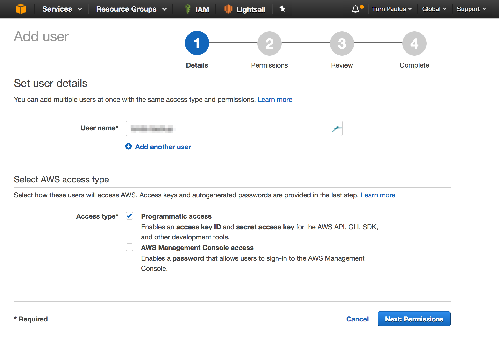
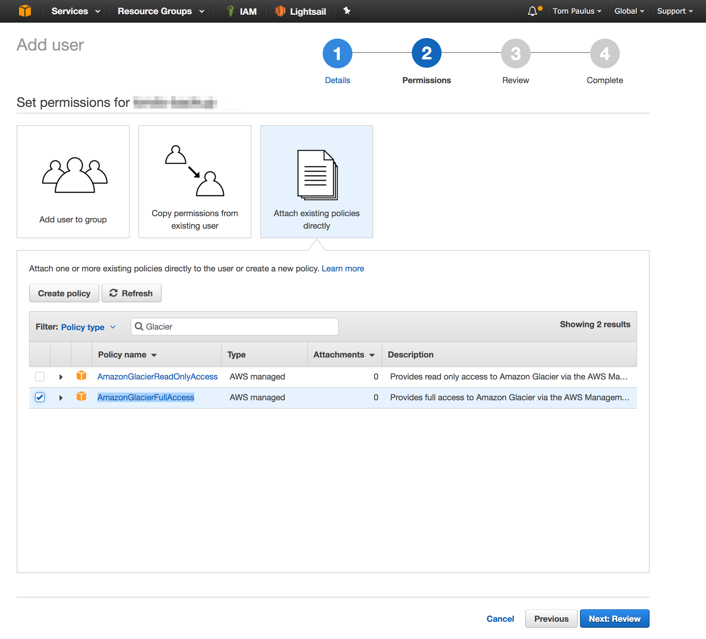
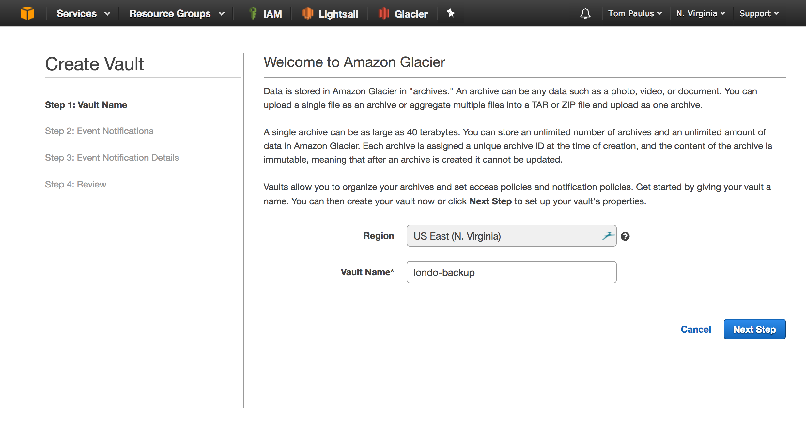
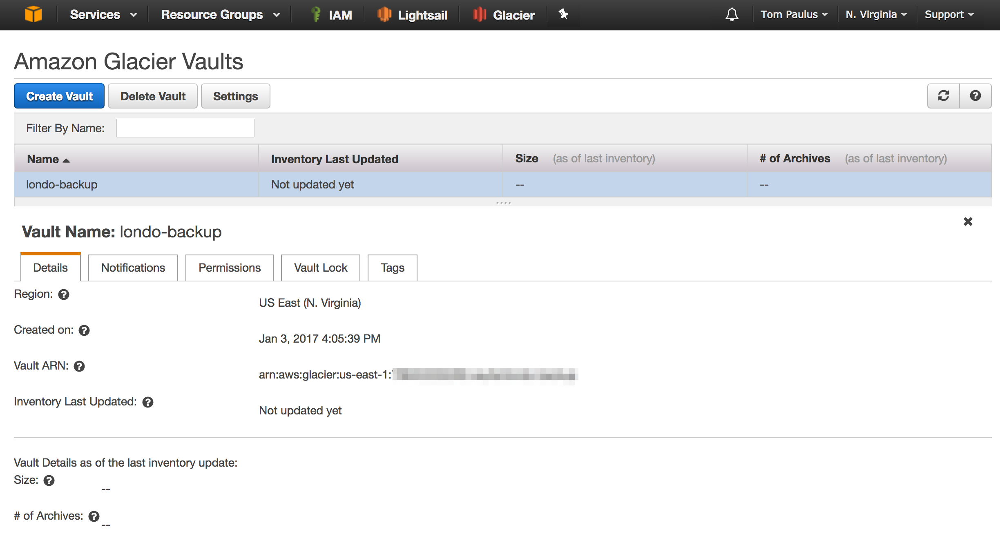
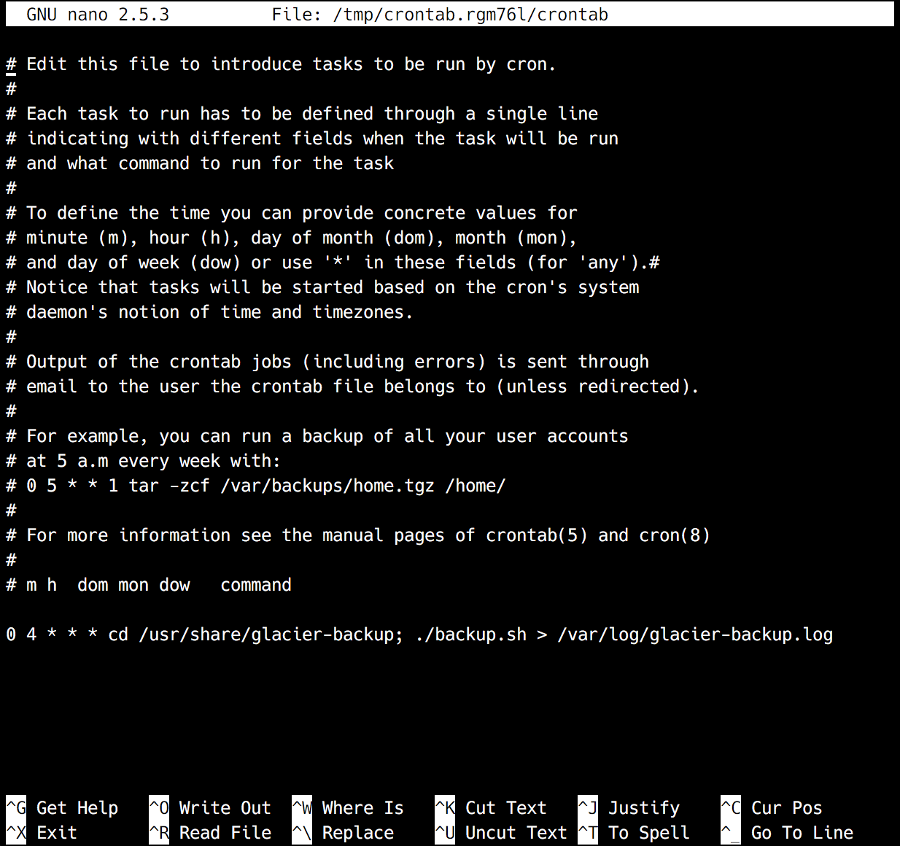
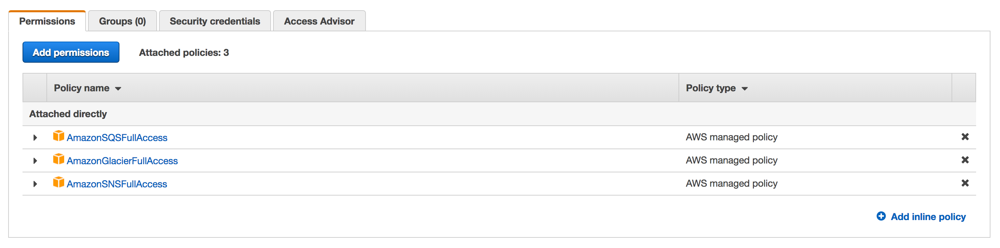
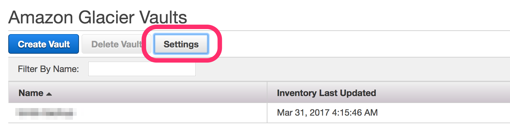
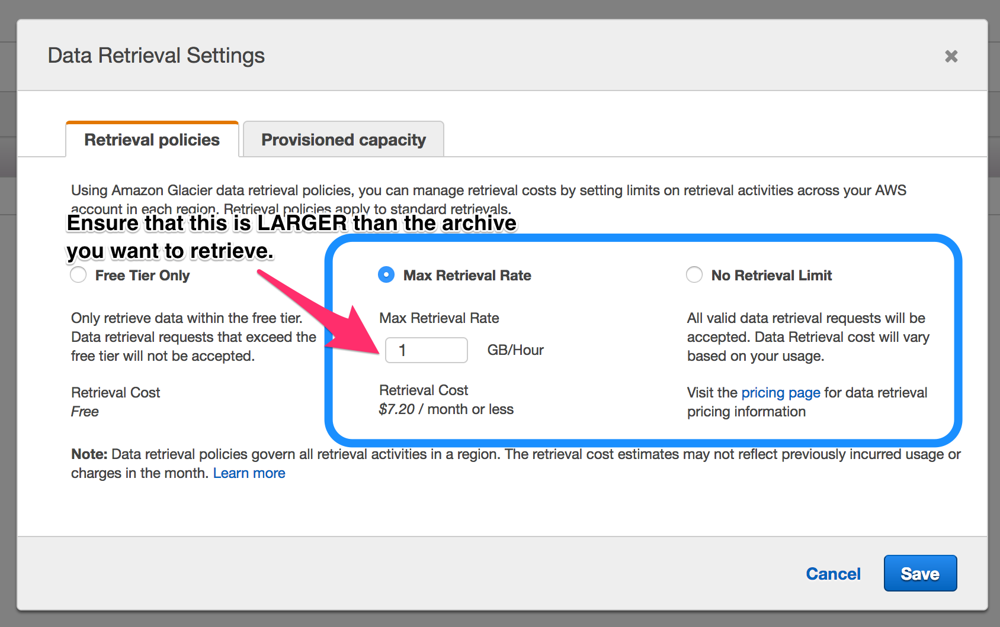

[Amazon Glacier](https://aws.amazon.com/glacier/) is a long-term, low-cost data archival and backup service offered by AWS. It is surprisingly cheap at only $0.004[^1] per GB per month, it has some caveats though. Mainly, retrievals can take upto 5 hours, and archives must be stored for a minimum of 3 months[^2].

Glacier is available in most, if not all, of their data centers, but I will be using the **US East (N. Virginia)** datacenter, since that is where my [Lightsail](https://lightsail.aws.amazon.com) instances are hosted, and inter-datacenter transmissions are free. If you are using Lightsail, make sure to turn on VPC Peering; this should facilitate communication between your LightSail VPS and the Glacier system.

Since I want to use my storage space most efficiently, I will only be backing up the "non-recoverable" information I have saved on my server. This includes, database dumps, images, configuration files; however, does not include Docker Images, etc. My logic behind this is, that in the event of a failure, I can easily pull a docker image from the repository, or reinstall a tool via apt, so I do not need to save a copy. Also, since archives will be saved for an extended period of time, depending on your desired backup frequency, saving a few hundred megabytes can add up over a few months of backups.

#### Background on Glacier

While the AWS management console allows you to do some work with Glacier, most interactions will occur via a CLI or API requests. Thankfully, Glacier is a relatively popular service, so other developers have already written scripts and tools to help us work with Glacier. _AWS has also written a well documented SDK for Glacier as well._

Glacier treats every file that is uploaded as an non-mutable archive, be it a photo, video, or in our case a ZIP file. Each file is assigned a unique ID which can be used to identify the archive in Glacier.

Since our Archives will likely be larger than 100MB, we will be using a Multipart upload, which allows the upload of a single larger archive to be chunked and parallelized. It also allows for easy recovery if something goes wrong while uploading a chunk, as only that chunk needs to be reuploaded, not the entire archive. The Multipart Upload process is discussed in detail on the Developer Guide for Glacier: [http://docs.aws.amazon.com/amazonglacier/latest/dev/uploading-archive-mpu.html](http://docs.aws.amazon.com/amazonglacier/latest/dev/uploading-archive-mpu.html).

#### Configure Glacier

Before we get started on our backup system, we have to do some work in the AWS Management console. Before you start, make sure that you have set the correct region in AWS for where you want your Glacier Vault to be.

##### IAM

We will first create an IAM user with `Programmatic access` which we will use to authenticate our backup agent with AWS. Next, we will attach the `AmazonGlacierFullAccess` policy to our user, this will allow our user to upload archives to our Vault. Take note of the Access Key and Secret key for the user you just created, as you will need to save them in a config file a little later. **This is the only time you will see these, however you will be able to create additional keys later if necessary.**





##### Glacier

Navigate to the Glacier service in the management console, and click get started. The region that you chose earlier should be listed, as well as a prompt for the nave of your vault. The name of your vault must be unique across the region! You can setup SES notifications if you like about Vault Statuses, but you can skip that safely if you like.

  


#### Configure System to be Backedup

Clone the [GitHub Repository](https://github.com/tpaulus/glacier-backup), which contains the uploader.jar, backup script, and aws.properties template via `git clone https://github.com/tpaulus/glacier-backup.git`. You may need to make the backup script and the uploader jar executable, which can be achieved by `cd`ing into the folder and executing `chmod +x *.sh *.jar`.

##### Configure Backup Script

Once you have cloned the repo, modify `aws.properties` with the `accessKey` and `secretKey` that you took note of when you crated your IAM user. Next update the fields at the top of in `backup.sh` with the correct values. The correct endpoint url can be found at: [http://docs.aws.amazon.com/general/latest/gr/rande.html#glacier\_region](http://docs.aws.amazon.com/general/latest/gr/rande.html#glacier_region). You should use HTTPS wherever possible.

The script assumes that you have your MySQL running in a docker container, whose name is a variable defined at the top of the script. Modify this section, or the other sections to suite your needs. If you are trying things out, set `SANDBOX` to `true` to disable the uploader and cleanup portions of the script. This prevents the compressed archive and backup folder from being deleted, so you can check if everything worked as desired, without having to deal with Glacier.

##### Running the Script

Before you can run the script, you may need to install Java, you can check if Java is installed by running `java -version` in the command line. If an error is returned, you need to install Java. On Ubuntu, this can be achieved by running `sudo apt-get install openjdk-8-jre-headless`.

Once you have verified that the script works as desired, you will want to add it as a cron job to run regularly.

##### Cron Job

Lastly, we will want to have our backup run automatically on a schedule, which can be easily achieved with the help of CRON. CRON allows you to input when you want a certain command or task run, and it will take care of the rest for you automatically. To help generate your crontab line, tools like [Crontab Generator](http://crontab-generator.org/) can take out most of the guess work and frustration. For the command, you will want to `cd` into the directory to which you cloned the repository, and then execute the script. My finished crontab looks something like this:

```
0 12 * * * cd /usr/share/glacier-backup; ./backup.sh >> /var/log/glacier-backup.log 2>&1
```

I decided to have my script run at 12PM (UTC) everyday, since that is a time when I expect not to make any changes to the server. If you are unsure of the timezone of your server, run `date` to find out the current date, time, and timezone of your system.

Now run `sudo crontab -e` to add the line you got from the Crontab Generator to your local `crontab` file. The sudo is necessary, as we want our script to be run by the root user to bypass any permissions issues.  
  
Save and exit, and you should see `crontab: installing new crontab`. This means that your line was added successfully to the crontab for the root user.

That's it, now you can rest assured that if something should go wrong, you have a recent backup of your essential files and databases that are safely stored offsite, ready for your retrieval within 5 hours[^3].

### Recovery Procedure

In the event that you should need to use one of the Backups from your Glacier Vault, you will first need to retrieve the Inventory from the Glacier System. Setting the environment variables as shown below will make our lives a little easier as we complete the steps necessary to recover an archive.

Additionally, the steps listed below use the same Command Line tool as we used above to send our Backup to Glacier, so ensure that the commands below are being executed in the same directory as the `backup.sh` file. This is done to make sure that the `aws.properties` file is located in the correct place in relation to the JAR file being executed to interface with Glacier.

##### Set Common Environment Variables

The values for most of these variables will be the same as those found at the top of the `backup.sh` file. They are not in a shell file, however, because this process can take some time to execute[^4].

```sh
export CREDENTIALS="aws.properties"
export ENDPOINT="https://glacier.us-east-1.amazonaws.com"
export VAULT="myvault"
```

#### List Inventory

```sh
java -jar glacieruploader.jar --endpoint $ENDPOINT --vault $VAULT --credentials $CREDENTIALS --list-inventory 
```

This will give you a job ID for the inventory listing, make note of this, as you will need it to access the result.

```sh
java -jar glacieruploader.jar --endpoint $ENDPOINT --vault $VAULT --credentials $CREDENTIALS --list-inventory yourjobidfromthepreviousstep
```

Be sure to include the jobid from the previous step in the above command. You will receive an error massage (status 400) until the inventory has been generated for you to retrieve. This can take about 4 hours, depending on Vault Size and Demand, according to the Amazon Developer Documentation.

#### Download Archive

Once you have found the desired archive that you would like to retrieve from your inventory, making note of its `Archive ID`, you can request it via:

```sh
java -jar glacieruploader.jar --endpoint $ENDPOINT --vault $VAULT --credentials $CREDENTIALS --download myarchiveid --target path/to/filename.zip
```

Make sure to change the Archive ID that you want to download to one in the inventory, and the target to the location you want the archive saved.

**Note:** In order for you to retrieve the Archive, your IAM User that you have configured (see above) will need access to the Amazon SQS and SNS Service. This is a separate permission than the one granted for Write Access to Glacier.



If you are getting errors in regard to the "current data retrieval policy," have a look in your Vault General Settings, accessed via the Management Console, and make sure that you allow for enough data to be downloaded per hour. You should set the cap a little above the estimated size of the archive that you want to retrieve. The higher you set your retrieval cap, the more you can be charged. You are only charged for retrieval, this is not a monthly fixed charge.

  


That's It. While retrievals can be time intensive, they significantly lower cost makes it worth it for most users. If you find yourself making a significant number of retrievals, you may want to consider configuring Expedited Retrievals via provisioned capacity, or moving to S3 for Hot-Storage, rather than Glacier, which is considered Cold-Storage.

[^1]: At time of writing, each GB of Glacier storage in Region: US-East-1 (N. Virginia) cost $0.004. Updated pricing can be found at [https://aws.amazon.com/glacier/pricing/](https://aws.amazon.com/glacier/pricing/)
[^2]: While archives can be deleted at anytime, the documentation states that you will be charged a prorated fee for the remaining duration. [https://aws.amazon.com/glacier/faqs/](https://aws.amazon.com/glacier/faqs/)
[^3]: Archive retrieval times depend on the archive size and retrieval option selected. More information can be found in the Glacier Developer documentation: [https://docs.aws.amazon.com/amazonglacier/latest/dev/getting-started-download-archive.html](https://docs.aws.amazon.com/amazonglacier/latest/dev/getting-started-download-archive.html).
[^4]: While this process can be automated with the help of Amazon SNS and an Amazon SQS queue, that can be a bit more complex to setup and configure. If you will be frequently be retrieving archives (at which point you should re-consider your use of Glacier) it may be advantageous to look into this: [https://docs.aws.amazon.com/amazonglacier/latest/dev/retrieving-vault-inventory-java.html](https://docs.aws.amazon.com/amazonglacier/latest/dev/retrieving-vault-inventory-java.html)
