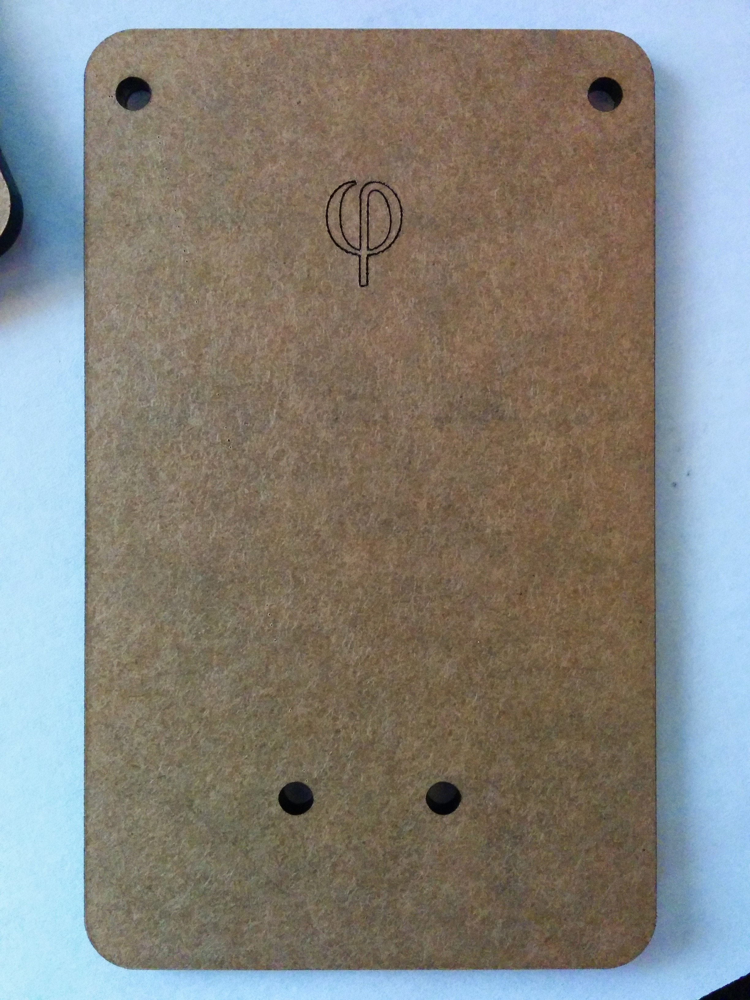
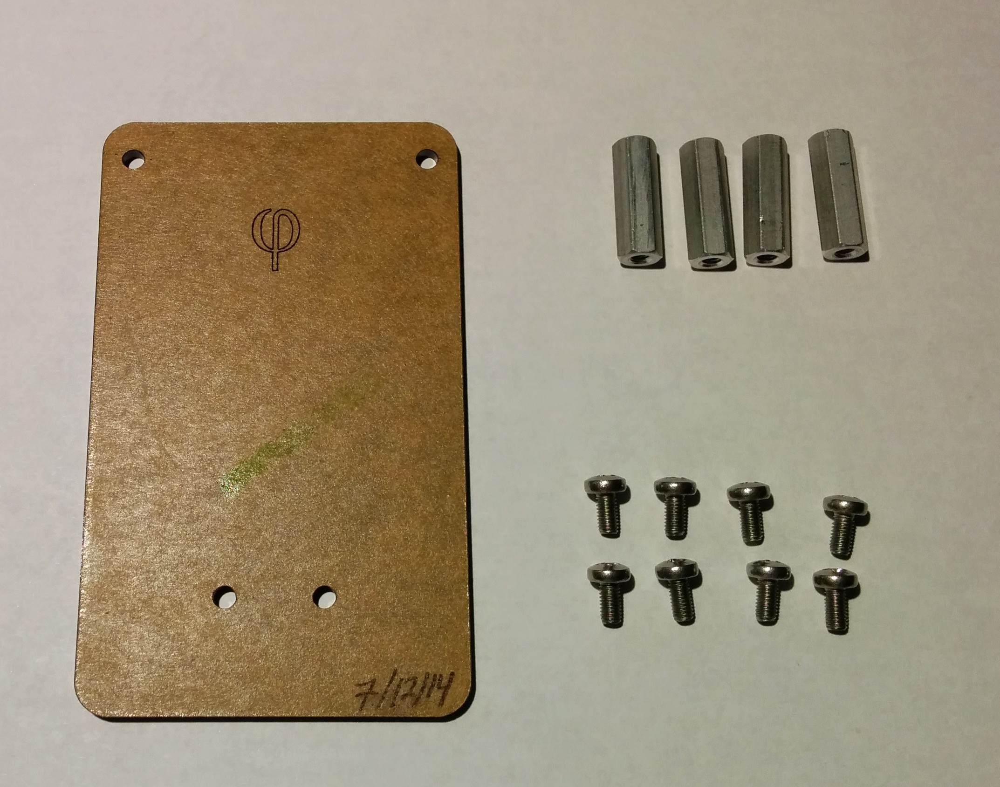
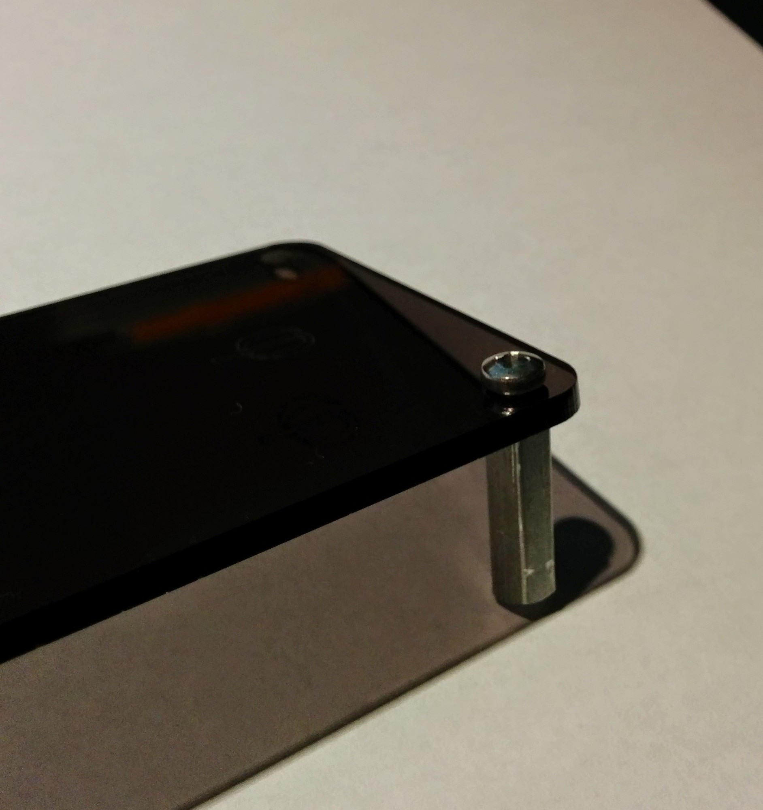
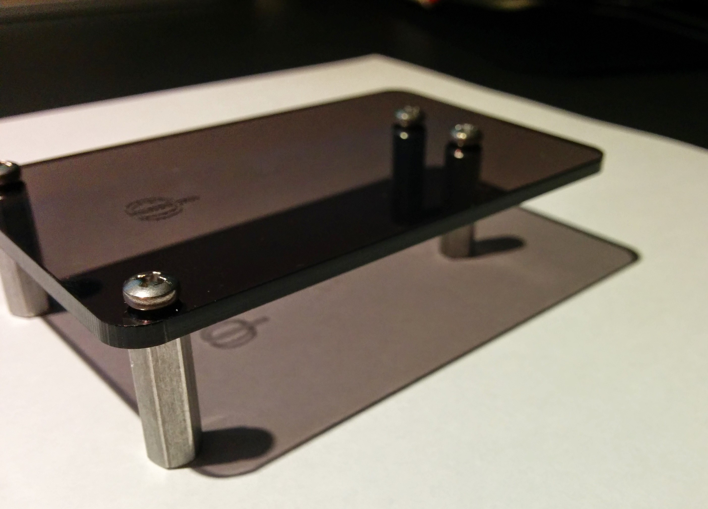
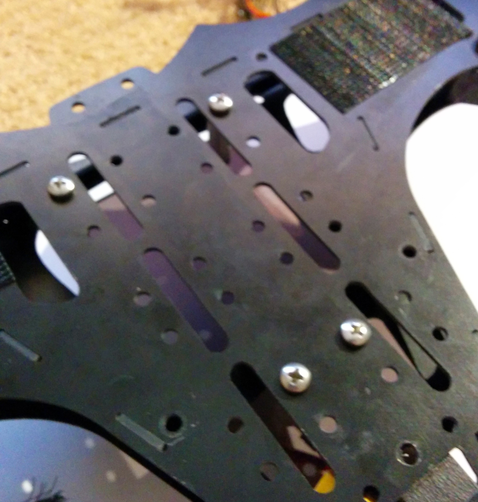
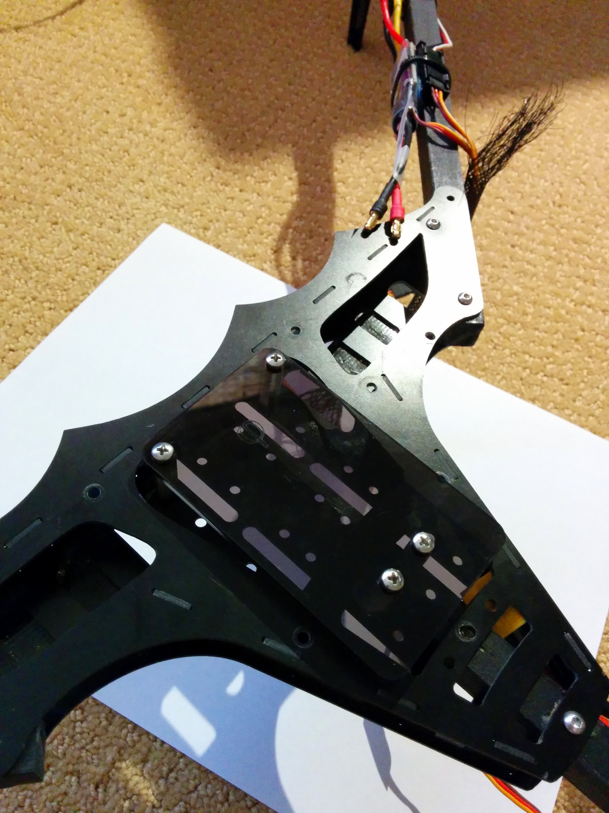

Perfect for mounting your [ArduPilot](http://3drobotics.com/ "3D Robotics Website") (Both Mega and PixHawk) or any other large size flight Controller. The [BatBone](http://store.flitetest.com/bat-bone-tri-370-kit/ "Bat Bone Tri 370 Kit") comes with mounting holes for the standard 45mm size Flight Controllers, Like Hobbyking’s KK2 series boards, but it lacks the ability to mount larger flight controllers easily.

Many people, like myself simply Velcro the flight controller to the small surfaces on the top of the frame, but this doesn’t provide a sturdy and secure way to mount, the arguably most important piece of your multicopter, your flight controller. Another problem is that some flight controllers don’t have mounting holes; this is result of the design of the board, or a case that the board is in – this is the situation I am in, my APM 2.6 comes in a very nice case that both protects the board and stabilizes the barometric pressure sensor’s readings.

I developed a plate that sits above the frame and allows me to mount my flight controller on a large flat surface with velcro that covers the entire area of my flight controller, allowing for a much more stable mount. I designed it using a free alternative to Adobe Illustrator called [Inkscape](http://www.inkscape.org/en/). I took many measurements and printed out countless renderings of my design before I submitted it to an online laser cutting service called [Ponoko](https://www.ponoko.com/). I selected a 3mm Gray tinted acrylic for the looks and had it made, more specifically 6 of them, as I crammed as many as I could on their smallest sheet.

I paired the acrylic with a set of threaded Aluminium standoffs.

_All required pieces_

The standoffs are attached to the plate, and then to the Bat Bone itself. The Hole pattern allows the [Flite Test Camera Tray](http://store.flitetest.com/vibration-dampening-camera-mount-kit/ "Vibration Dampening Camera Mount Kit") to be attached with little modification, just shorter screws than were included in the Flite Test Kit. The Standoffs are M3 size and I used a set of 12mm button head screws from my local hardware store.

_All Standoffs Attached_

Some finesse is required when attaching the acrylic to the BatBone as the laser cutting is not perfectly accurate and the standoffs can be manipulated, but in the end it looks and works great.

_Underside of the BatBone_

_Top of the Bat Bone with the Plate Attached_
