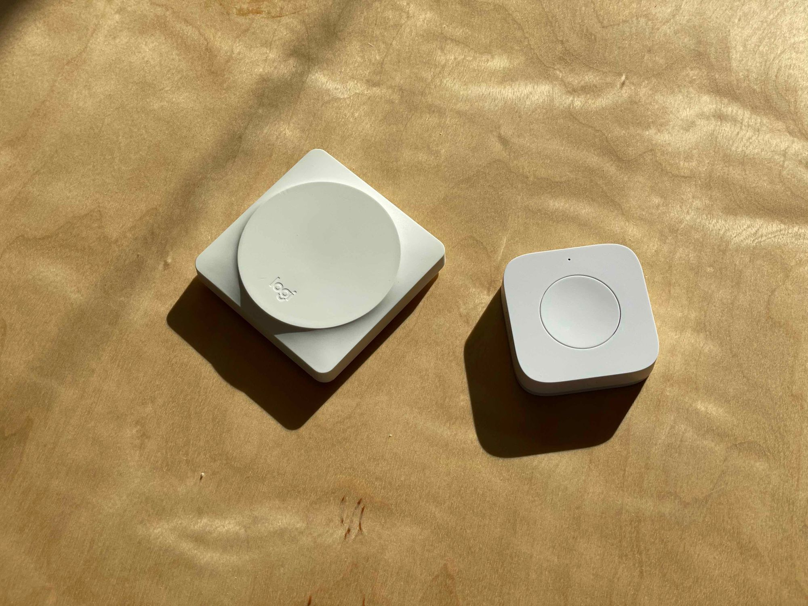
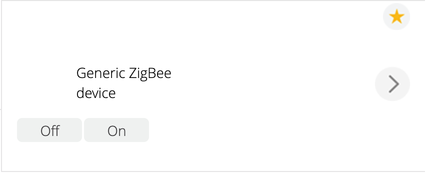
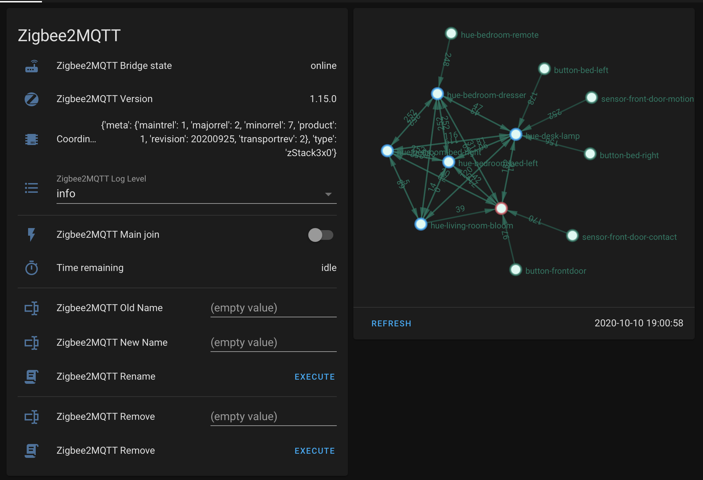
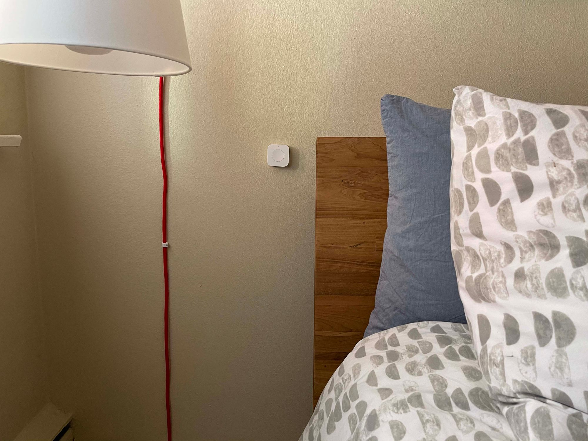

I got my first set of [Logitech Pop buttons](https://www.amazon.com/gp/product/B01JO8TIH4) (Small BT LE Buttons that interface with a WiFi Hub) in December 2017 and they have moved with me from college dorm room, to dorm room, finally making their way on the wall next to my bed in my apartment now where they control the various lights not only in my bedroom, but in the entire apartment. Ever since the beginning, I have leveraged the convenience of these tiny, reliable (I have yet to need to change the batteries in over 3 years of clicking) via IFTTT. However, with the [recent announcement](https://ifttt.com/explore/introducing_ifttt_pro) of IFTTT moving to a subscription model, I needed to look elsewhere. While all of the lights in my bedroom are Philips Hue bulbs, many of the other smart devices I have in the rest of my place are not, leading me to use a central automation tool ([Home Assistant](https://www.home-assistant.io/) in my case) to manage everything.

<figure class="kg-card kg-image-card kg-card-hascaption"><figcaption><span style="white-space: pre-wrap;">Logitech Pop Button (Left) next to a Xiomi Aquara Button (Right).</span></figcaption></figure>

The Logitech Pop bridge supports a number of integrations, including Philips Hue, IFTTT, Smart Things, etc.; but what they do not support is local access, meaning that while getting bridge to talk to Home Assistant is theoretically possible using an emulated-hue bridge and a lot of time, it just is not feasible in my case. As such, I am parting ways with my beloved Pop buttons (oh, how beautiful they are), and replacing them.

There are a number of IoT clicky things out there, one of the most notable being [Flic](https://flic.io/). However, not only is a set of Flic buttons incredibly pricy (a starter kit with 2 buttons costs $159.99 at the time of writing), they have many of the same pitfalls, although offering a Home Assistant Integration, it relies on bypassing the hub and using the bluetooth module on the host running Home Assistant. For some context, I run Home Assistant on an Intel NUC via docker, so Bluetooth device access is possible, but again not practice, plus I have some concerns about the Bluetooth range from where the NUC is, to where the buttons would be. Some googling lead me to [this Reddit Post on r/homebridge](https://www.reddit.com/r/homebridge/comments/ghxqf7/any_alternative_wifi_buttons_to_the_logitech_pop/). This post and its comments, along with a lot more googling (free time is in great abundance this year), I landed on the Xiomi Aquara Buttons, which run about $18 on [Amazon](https://www.amazon.com/gp/product/B07D19YXND). These are ZigBee buttons, which means that they require a compatible hub of some sorts. I didn't think anything of this though, as I already had a working VeraPlus Hub, which among other things supports both ZigBee and Z-Wave devices. So I ordered 3 to replace my small family of Pop buttons and waited.

When the buttons arrived, I was quite pleased with their design and build. Yes, nowhere close to as thin and sexy as the Logitech Pop buttons, but for the price, I was more than happy to put up with the slightly more clunky build, if I could get them to work. Keyword being _if_. After a fair bit of fiddling, I got them to associate to the Vera, resetting them, and then pushing the "Effective Range Test Button" every few seconds while the Vera was in search mode eventually got them to associate. However, Vera does not officially support Aquara devices, so they showed up as Generic IO devices.

<figure class="kg-card kg-image-card kg-card-hascaption"><figcaption><span style="white-space: pre-wrap;">Vera Dashboard showing "Generic ZigBee device"</span></figcaption></figure>

There were a fair number of people trying to get Aquara devices to work on [Vera's Community](https://community.getvera.com/t/xiaomi-aqara-stuff-works-natively/209255), but the post has been inactive for 9 months no, with only some success getting the Temperature sensor to work. Xiomi has a hub that you can plug in and add to your network, but given the [news on Xiomi's data collection practices](https://www.androidauthority.com/xiaomi-privacy-cheap-phone-1118444/), I was hesitant to add one of their devices to my home network, even if it was on an isolated VLAN. On top of that, I generally try to avoid vendor lock-in wherever possible, especially in the IoT space, where the fall of a company can lead to a very hungry cat, [as we saw with Petnet](https://twitter.com/internetofshit/status/1228489002946375682). So, I did some more googling (again, free time is not hard to come by in the midst of a pandemic), and stumbled upon [ZigBee2MQTT](https://www.zigbee2mqtt.io/).

I had used MQTT before, when I built a [ESP8266-powered, internet-connected heart light](/project-heart/), so I was aware of how quick and powerful it was. So, I did some reading and ended up ordering a _zig-a-zig-ah_ from Electrolama on [Tindie](https://www.tindie.com/products/electrolama/zzh-cc2652r-multiprotocol-rf-stick), wanting to avoid the frustrations of flashing a CC2531 USB sniffer, and wait a short eternity for some _very_ reliable parts to arrive from AliExpress. So, I waited.

I had some hardware issues with the adapter that I originally received, but Omer from Electrolama was very quick to respond to my concerns and before I knew it I had a new adapter in my hands. From there, it was almost plug and play. For compliance reasons, the adapter ships with a simple blink program, but there is some excellent documentation on the Electrolama website that details how to flash the correct firmware for ZigBee2MQTT on to the device, which is accomplished with some python libraries which are installed via pip, and a python script to handle the flashing. Once flashed, the _zig-a-zig-ah_ shows up as a USB serial device, so no extra drivers were needed (I am using Ubuntu Server 20.04 LTS, your milage may very). From there, I was on the home stretch. Because I already use Docker for most of my needs on my home server, I went with the Container version of ZigBee2MQTT.

```shell
docker run \
   -d \
   --name="zigbee2mqtt" \
   -v /etc/docker/zigbee2mqtt/data:/app/data \
   --device=/dev/ttyUSB0 \
   -e TZ=America/Los_Angeles \
   --restart=always \
   --network host \
   koenkk/zigbee2mqtt
```

On first run, ZigBee2MQTT creates the default configuration file, which requires a slight bit of modification before ZigBee2MQTT can be started successfully. Namely, I needed to change the Serial device it was trying to use, and I reconfigured the Network Key while I was here and hadn't paired any devices.

```yaml
homeassistant: true
permit_join: false
mqtt:
  base_topic: zigbee2mqtt
  server: 'mqtt://127.0.0.1'
serial:
  port: /dev/ttyUSB0
  adapter: zstack
advanced:
  rtscts: false
  network_key: GENERATE
```

I was already running a MQTT server that I had already wired in with Home Assistant, but that too is relativity trivial. Home Assistant makes everything pretty easy, especially with their Discovery Functionality. ZigBee2MQTT includes some very helpful configuration cards that you can include in your dashboard, which I included via the _Package Method_ described on the [documentation](https://www.zigbee2mqtt.io/integration/home_assistant.html). I also added the Network Map Card, which all together looks something like this once I got all of my devices joined.

<figure class="kg-card kg-image-card kg-card-hascaption"><figcaption><span style="white-space: pre-wrap;">ZigBee Network Information in Home Assistant Lovelace</span></figcaption></figure>

I found the provided card to do everything I needed it to do. All that was left for me to do was to configure the automations that I used to have configured in the Pop software for interfacing directly with Hue and the Automations that I had in IFTTT. On each side of my bed, I have a button that I use to control the Hue bulb that is directly above it, tapping once for a night light, twice for a reading light, and holding to turn off all the lights in the apartment. The last one was the easiest; however the previous two were much harder due to some intricacies of how Home Assistant handles `light.toggle` actions. Specifically, you can set the color and brightness of a light with `light.toggle`, but you call `light.toggle` again with a different color or brightness, rather than updating the color, it turns off the light. So after some searching and thinking, I came up with this automation.

```yaml
- id: '1601945836861'
  alias: Bedroom - Button - Right - Reading Light
  description: ''
  trigger:
  - platform: device
    domain: mqtt
    device_id: 98de24c1076711eb9eb06778c10b3ef9
    type: action
    subtype: double
    discovery_id: 0x00158d00027bf559 action_double
  condition: []
  action:
  - choose:
    - conditions:
      - condition: template
        value_template: '{{ state_attr(''light.hue_bedroom_bed_right_light'', ''color'')
          == {''x'': 0.447, ''y'': 0.406} and is_state(''light.hue_bedroom_bed_right_light'',
          ''on'')}}'
      sequence:
      - service: light.turn_off
        data:
          transition: 1
        entity_id: light.hue_bedroom_bed_right_light
    default:
    - service: light.turn_on
      data:
        profile: reading
        brightness: 254
        transition: 1
      entity_id: light.hue_bedroom_bed_right_light
  mode: single
```

I have 4 similar instances of this automation, one for the night light and one for the reading light, for each side of the bed. The differences being the colors/brightnesses and the devices respectively. Specifically what this automation does, is it checks if the light is in the desired state already (both in terms of color and state) and if it is, turns off the light, if it isn't, it means that the light is in a different state and the user is requesting a state change, which is achieved via a call to `light.turn_on` with the desired parameters.

All in all, once I got everything working (which wasn't too difficult honestly), things have worked great. The buttons are much more responsive, especially for the automations that used to leverage IFTTT. I have also already made some more additions to my ZigBee network, like moving my Hue Bulbs and remotes over to ZigBee2Mqtt and getting a SmartThings Motion Sensor and Door Contact Sensor to replace a similar ZWave set. From my small sample size, ZigBee is much more responsive than ZWave, although that may also be because of the setup I was using for ZWave (using a VeraPlus connected via Home Assistant) was less than ideal. I must give credit to the ZigBee2MQTT team and community for making a reliable, easy to use, and well supported piece of software that makes integrating these physical devices into our Home Automation Systems so easy (and dare I say it, fun).

<figure class="kg-card kg-image-card kg-card-hascaption"><figcaption><span style="white-space: pre-wrap;">A Xiomi Aquara button mounted on my bed side.</span></figcaption></figure>
