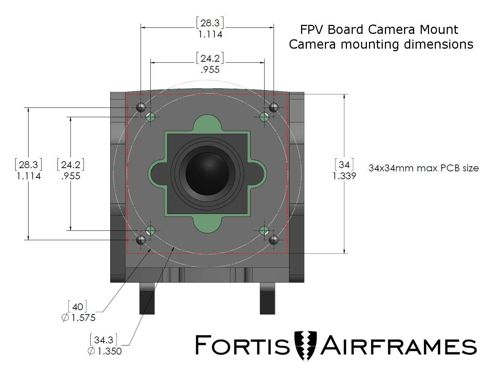

I’m using the [Fortis Airframes FPV Camera Mount](http://www.fortisairframes.com/fpv-board-camera-mount/) to mount my Board Camera for my FPV setup. It’s a really nice mount that protects the camera in the event of a crash.

I asked Zach, owner of Fortis Airframes, for a good camera that would work with the mount as there is little specific information on their website. I really like cameras that can support 5 volts as my [ImmersionRC 600mW Video Transmitter](http://www.readymaderc.com/store/index.php?main_page=product_info&cPath=165_40&products_id=266#.VbGMcng5-nY.link) produces a clean 5 volts internally.

Zach recommended the new [RunCam 600TVL](http://www.securitycamera2000.com/products/RunCam-600TVL-DC-5%252d17V-Wide-Voltage-Mini-FPV-Camera%252dUS.html) which works with the newer version of the FPV mount as it uses a 24.2mm hole pattern. – Make sure you get the one without a case and with IR Blocked! I prefer the 2.8mm lens over the 3.6mm, but that is a matter of preference.

The Sony HAD cameras are also very popular and I like them very much, but most only can take 12 volts. This isn’t an immediate problem if you have a 3s setup, but the video can get very noisy if you use the power directly from the battery without an LC filter. This problem can be solved with either an LC Filter or a voltage booster, which can be found on [Amazon](http://www.amazon.com/gp/product/B00FIYOK5O?psc=1&redirect=true&ref_=oh_aui_search_detailpage) for relatively cheap (This one is recommended by Zach). They take the power from the VTx and boost it to 12v, all you do is wire it up and watch the output with a voltmeter- then you adjust the potentiometer until you get 12v.

A lot of common FPV cameras will work, as long as they fit the hole pattern.

I went with the RunCam Camera, which should be a good choice. If you have questions about the Camera Mount, shoot an email to Zach ([via their Contact Page](http://www.fortisairframes.com/contact-us/)).
