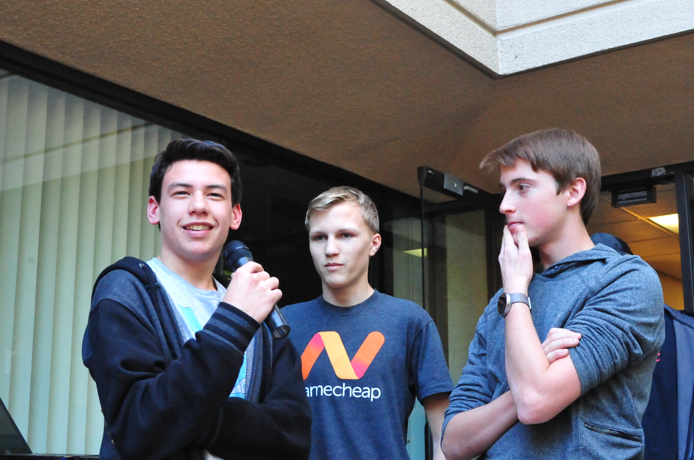
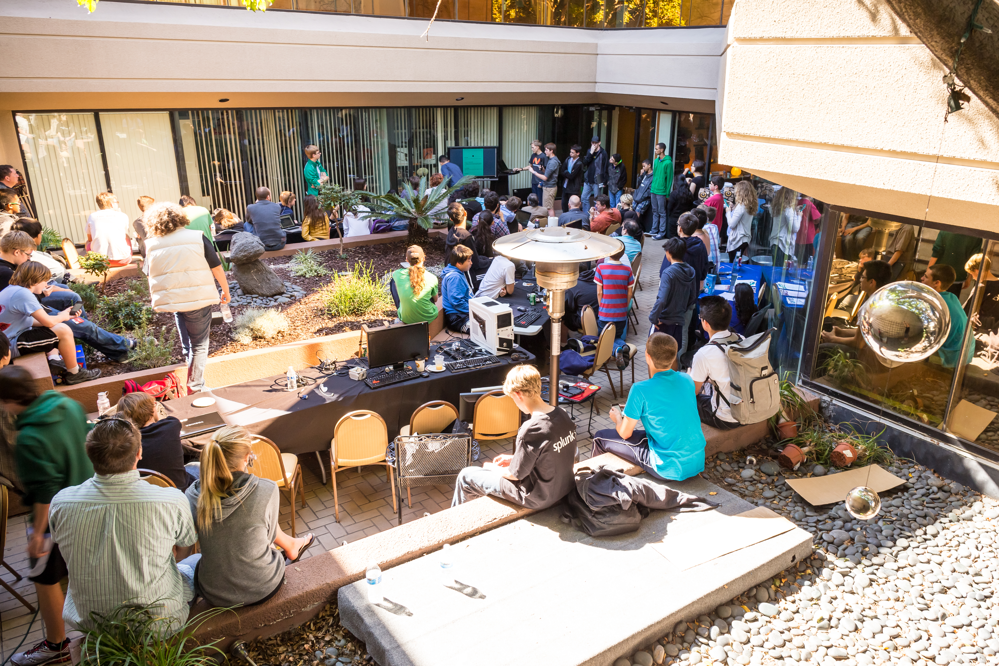

Would you like to learn how to make your own, super cool website? Or challenge your brain with a math puzzle? These were only two of the over 15 apps made by attendees at CodeDay.

CodeDay is a 24-hour programming marathon for Middle School through College Students. At CodeDay we focus on the people, not the end result and prices; and that is why we are different. Instead of judging solely based on how cool something is, we judge above all on whether the people had fun, pushed themselves, and learned something new. We invest in people and communities.

_Ramona High School Student, Erik Fink and his team present their project, a website that is aimed to make learning Physics Easier._

CodeDay is held thrice-annually in upwards of 20 cities. We had over 90 people attend CodeDay San Diego, the second largest event nationwide. Participants were between 35-45% girls, and over 60% of the people who came were new to programming, coming in with little to no experience.

I had the pleasure of organizing CodeDay Winter 2015 this past February and it was a Blast. I am responsible for organizing and managing the event from start to finish. Planning for the event typically starts 3 months before the event, and is split up into three phases (venue, sponsors, and promotion). The most difficult task is finding a venue that is capable of holding around 100 people and allows us to stay overnight; some events don’t take place because they cannot find a venue in time. But this wasn’t the case in San Diego, we were hosted by [CyberHive](http://cyberhivesandiego.org/) – a startup incubator in downtown San Diego.

CodeDay provides students an amazing way to learn things, make friends, and make connections that will prove to be useful later in life. CodeDay is an excellent learning environment for beginners because they have lots of resources available: workshops, volunteers, and the people around them; stuff you usually wouldn’t have at home.

_Participants gather outside for presentations. Presentations are a time for participants to show off the cool things that they were able to make during the event._

The event is great because it gets rid of the daunting feeling in beginners when it comes to programming, it encourages students to learn and puts them with others like them so they can learn together. “CodeDay is a very social event as well, I’ve seen lots of friendships come out of CodeDay.”said [TJ Horner](http://tjhorner.com/) a Local Organizer for CodeDay who has attended several CodeDays in the past. Local Organizers help to organize the event as well as help out the Evangelist during the Event. The evangelist is the emcee for the event, responsible for running the event and ensuring that everyone has a good time, I had the great opportunity to be the evangelist for CodeDay San Diego.

For more information go to… [http://codeday.org](http://codeday.org)
