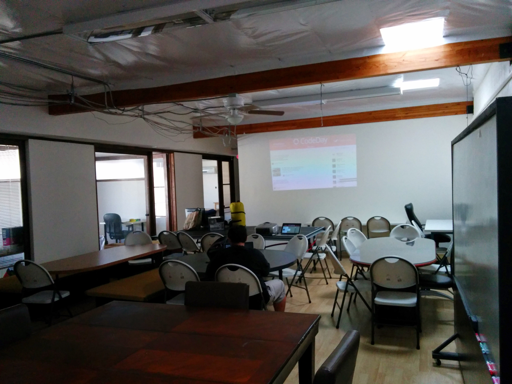
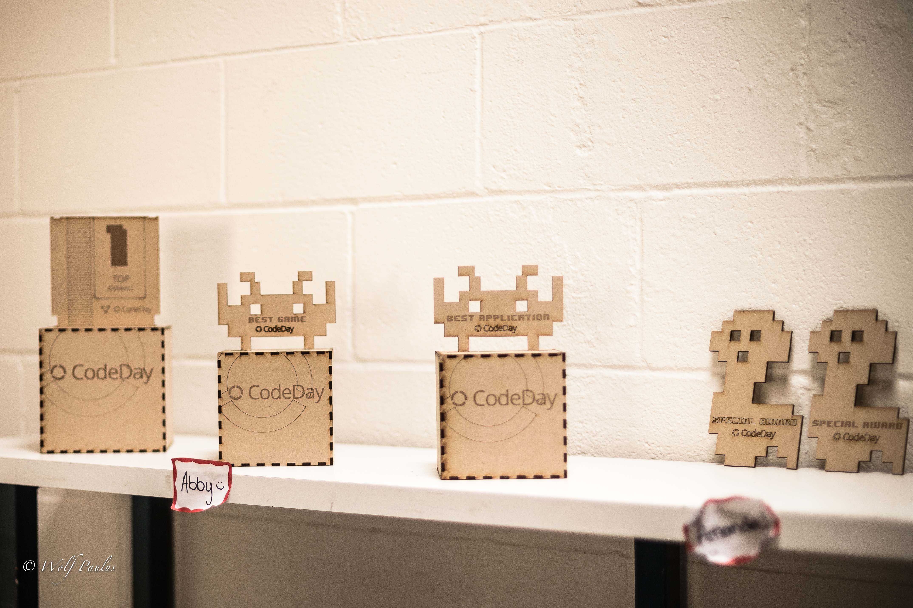
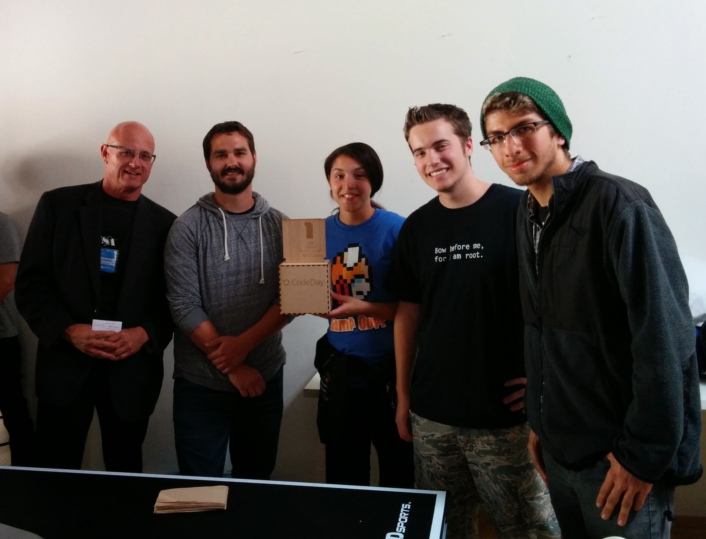
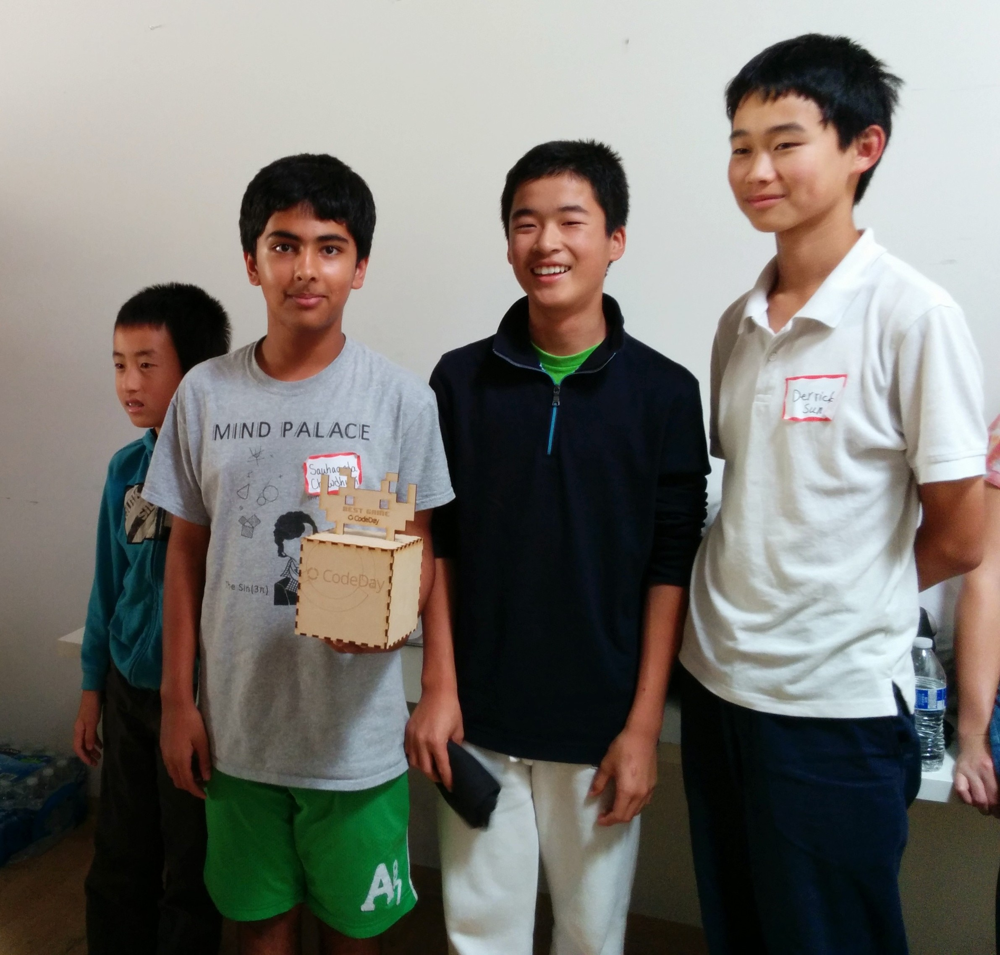
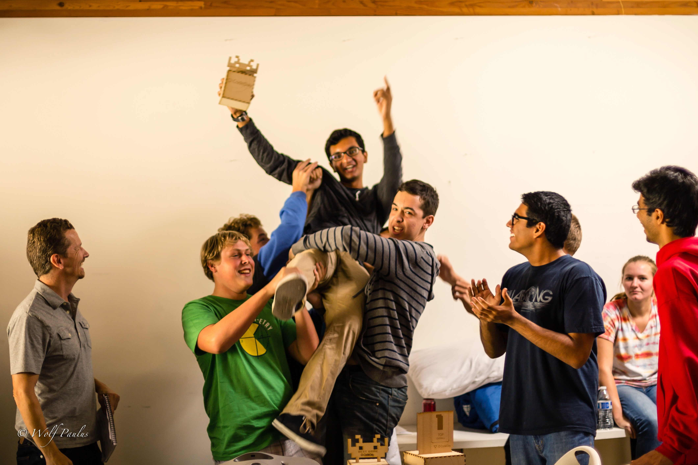
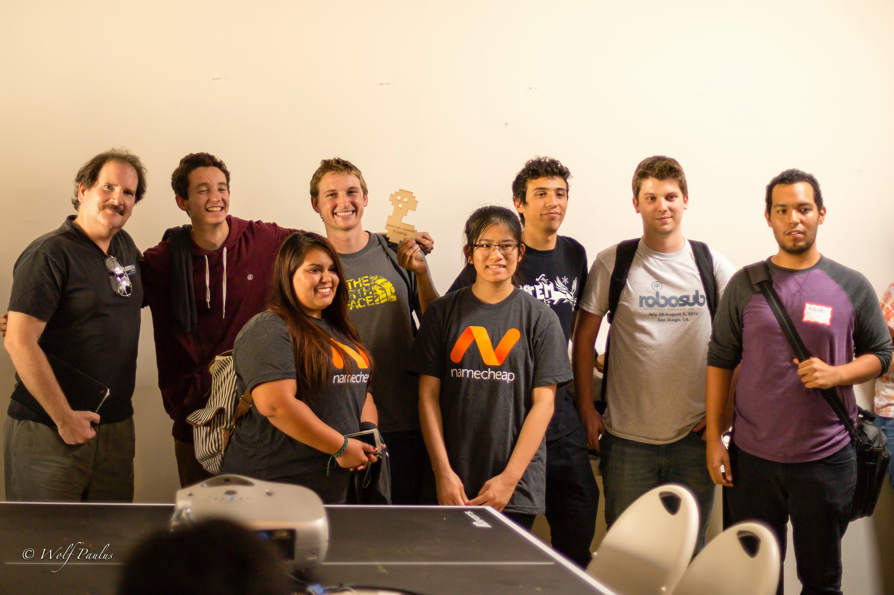
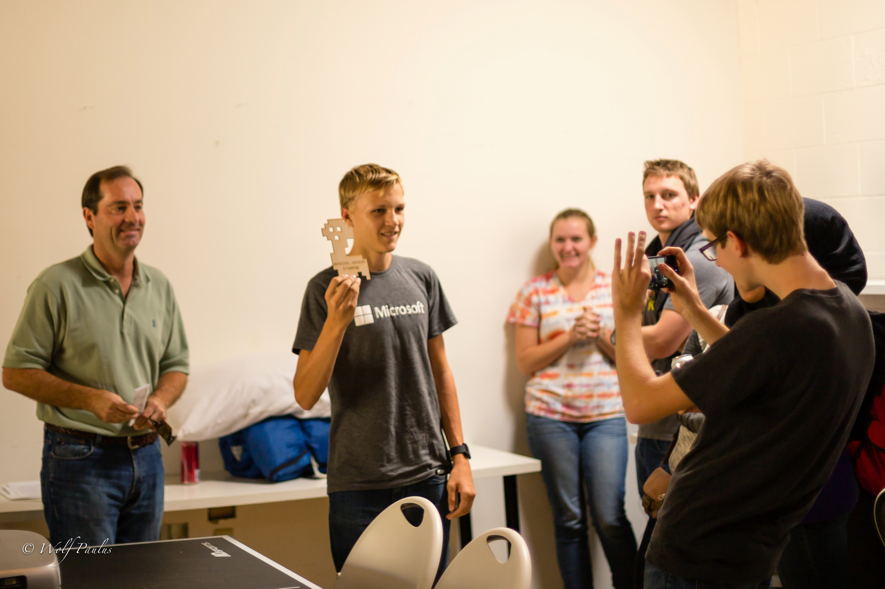

CodeDay is a 24-hour programing marathon for Middle School through College students. It is hosted 3 times a year – Fall, Winter, and Spring. The dates are set to fit with the 3-day weekends, because this is a very tiring event. This time, CodeDay San Diego was hosted at the [Ansir Innovation Center](http://ansirsd.com "Ansir Website"). _The Ansir Innovation center is a Co-Working Space located in Kearny Mesa. They were one of a very small group that would let us host this event for 24-hours in their space._

CodeDay is similar to many other hackathons for students, lots of food and little sleep. Many students depend on WiFi, like the rest of us, for looking up answers to problems; one of the best techniques to debug is to Google the error message and work from there. Certain problems arise when approximately 100 people try to connect to a small network. Down it went, at around 2pm the WiFi began to deteriorate. Rebooting the system did little to fix the problem.  
Even more depend on power, to keep their laptops running, or to power their desktops and monitors. Ansir had the outlets, but not the breakers. Within an hour of the event, we tripped the breaker for all the outlets in the main workspace. We had to go deep into the electrical room to find the breaker, but to our luck we were able to restore power and it would remain on for the remainder of the event.

## Food and Sponsors

Lunch was provided by STACKED Restaurants, they provide a unique ordering experience, based on their iPad ordering system. You only pay for what you want. Dinner was from Papa Johns and paid for by Mt. Sac (San Antonio) College. The Midnight Snack, Breakfast and Drinks were provided by Cyber United, a leading security firm, which also provides space to startups. Breakfast, Einstein’s Bagels, was loved by everyone, especially after a long night of coding.

## Winners

  
Code Day is different from many large-scale hackathons, like PennApps or MHacks, as there are no large prizes; only laser-cut trophies and a round of applause. CodeDay is more about the process of getting there, rather than the final product itself.

Winning doesn’t represent that you are the best, it represents that you have passion and the courage to step outside of your comfort zone. It starts at kickoff, pitching your idea, and it is persistent through the event, climaxing during presentations when you get to show off what you did.

### Top Overall

  
The top prize went to team “Username2” and their app “Dream Develop”. Dream Develop sought to connect creators and developers through a simple interface. Ideas would be proposed by the “Dreamers” and then made into reality by the “Developers”. The judges liked the story behind the app and the balance between team size and experience. The mix of genders was a big plus, “This is the future,” said Jerry, the judge who gave out the Top Overall award.

### Best Game

  
This prize is given to the second place in the game category. Team “Athenix” was composed of 7th graders who put together a game called “PuddiPuddi” – The adventures of a pudding cup and his quest to avoid the spoon monster who wanted to eat him.  
The judges were impressed by the level of completion in the game and the originality and creativity. They also didn’t use a game engine which furthermore impressed the judges.

### Best App

  
Team Collaboardtive created an Online, Interactive white board. The interface was clean and easy to use “I would start using that tomorrow,” said Judge Cordell, the judge who gave the award to the team. They found inspiration in the lack of whiteboards accessible to them at the event. They fought through the terrible WiFi and made it work in the end.

### 0-60 (Special)

  
Every year there are a few special awards, given to teams that didn’t quite make it, but still deserve to be recognized for their work. The “Financial Trackers” had the biggest team by far, and half of them had little to no knowledge of programming before the event. Their final product was not perfectly complete, but they had preparations to implement many additional feature; had we given them an additional day, they would have surely won the Top Overall Prize. The judges recognized their willingness to help other teams and how many people they got into programing.

### Most Innovative (Special)

  
Trevor, the winner of the Most Innovative award built a physics simulator that replicated gravity in a system, modeling planets and other bodies and their interaction with on another. He didn’t use any game engines, which impressed the judges. The app clearly demonstrated the principles and although there were a few bugs in the collisions, the results were amazing. He worked alone, and didn’t complain about the lack of internet, if he had a graphic artist on his team, the app would have been near perfect.

### Special Thanks to…

Our Judges: Jerry, Emmanuel, Bob, and Cordell

Our Local Organizers: Ayesha, Aaroh, and TJ

Our Venue Sponsor: Ansir Innovation Center

**Hope to see you at CodeDay Winter – February 14-15**
