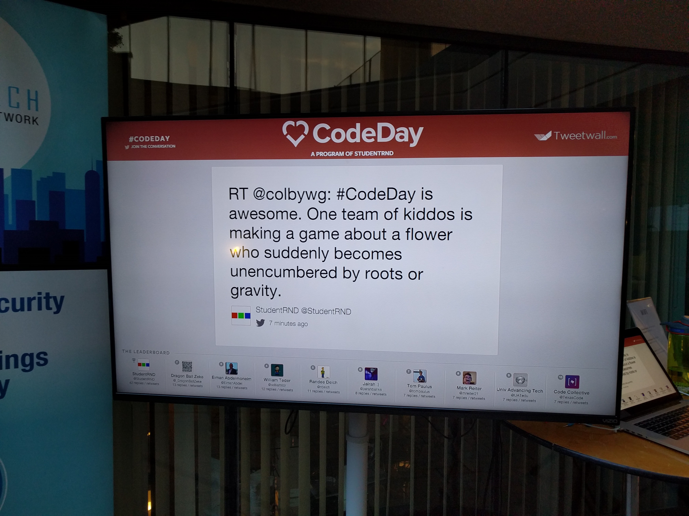
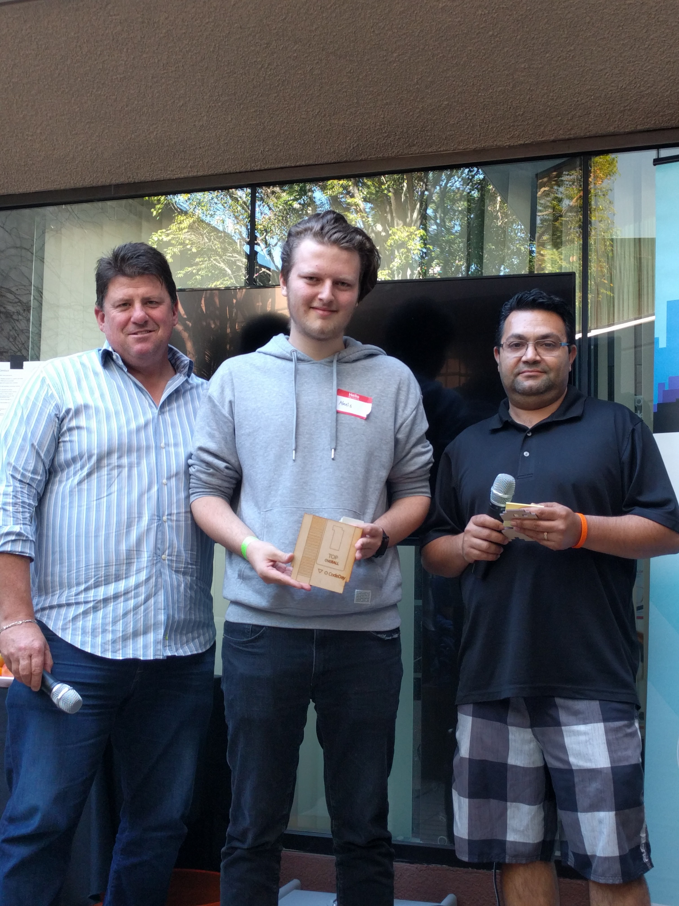
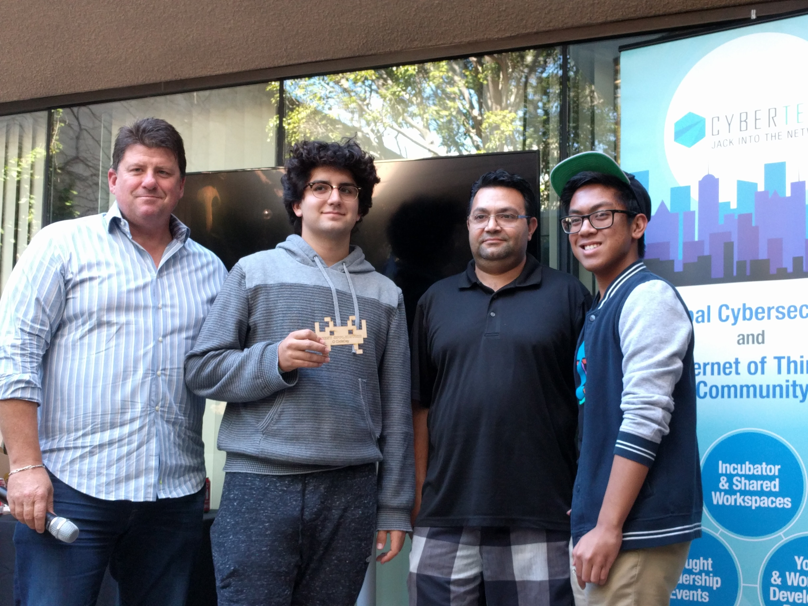
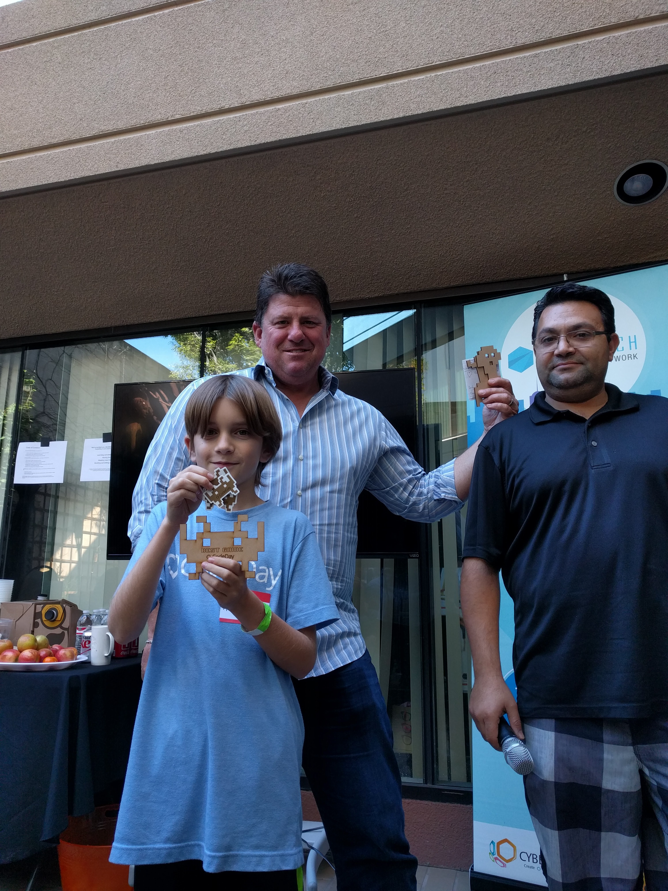
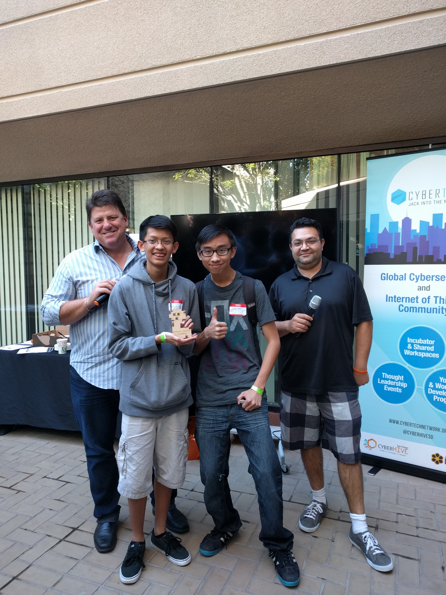
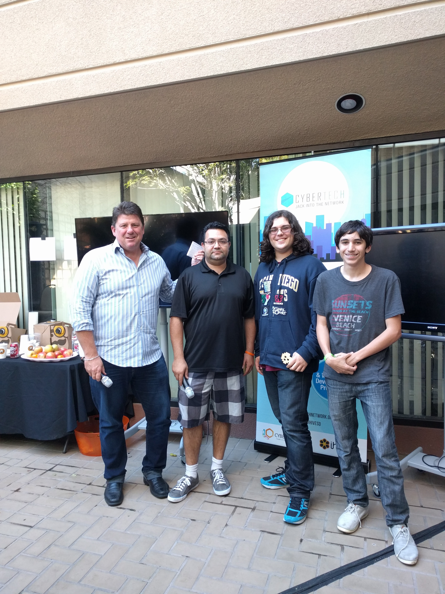

The sixth CodeDay in San Diego was a huge success. We returned to CyberHive this season, the venue that hosted the first CodeDay back in May 2014. This event was a little smaller than previous events, only 75 attendees registered for the event; however, the event was still a great success!

We lead more workshops than ever before, and included content for attendees who came to the event with some experience (an audience that has been underserved in past events).

### Best Overall

  
**Team: Team Tired**

**Project: 5 More Minutes**

This was Alexis’ first CodeDay and he blew us away with his Pebble Watch App that counted down the minutes till his class was over. He used tools and languages that he did not know coming into the event, something that the judges commended him for. Everyone was very impressed with Alexis’ work.

### Best App

  
**Team: ¯\\\_(ツ)\_/¯**

**Project: RNG Matchmaking**

This Valentine’s themed app match attendees from various CodeDay Events and other Coding Organizations to each other using a “complex algorithm.” They took the results a step further, showing the audience how there was a gender imbalance in the technology sector and how we can promote women to get involved with coding.

### Best Game

**Team: Anthony**

**Project: Jump**

Anthony continues to amaze event after event. This time he created an addicting game that featured a bird that had to jump up on randomly appearing platforms. If you failed to land on a platform, the bird would have a very un-happy ending. Anthony always amazes us with his willingness to help others and his creativity, even at 1am in the morning.

* * *

### Special Award – Most Memes

**Team: Meme Team**

**Project: Meme Defense Force**

This award was well deserved by Sam and Johnny! They combined the best meme’s and made a tower defense style game from villains like DJ Khaled. We all got a good laugh from their game. We hope they make another one!

### Special Award – Most Musical

**Team: Fourier**

**Project: GNUSynth**

Leo and Tiahm created an app to solve a problem. Tiahm creates music on his computer, but often needs a synthesizer, so they created one. The app used a myriad of audio analysis algorithms, including the Fourier Analysis (where the team got their name from).

* * *

Although this was one of San Diego’s smaller events, it was still a great success and the number of attendees worked well with the size and design of the venue.

### Special Thanks to…

Our Judges: Darin Anderson, Mo Rahseparian

Our Local Event Management Team: Ayan (Public & Community Relations), TJ (Event Programming), and Alex (Day-Of Coordinator)

Our Local Organizers: Agnieszka, Salman, Leo and Dan

Our Venue Staff: Darin and Mo

Our Venue Sponsor: CyberTech (Home to CyberHive, iHive and Nest)

Our Community Sponsor: Cox California
