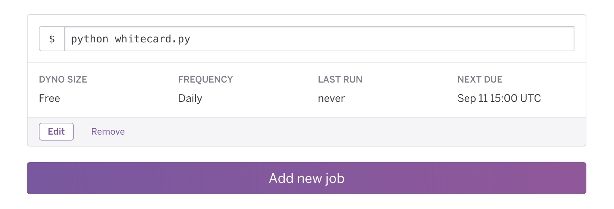

[Cards Against Humanity](https://cardsagainsthumanity.com/) is a College Favorite and often leads to some wonderful, even though somewhat disturbing, conversation. Through a strange series of events, a few of the staff of Maya Olmeca at the Front Desk ended up talking about the various White Cards[^1] and how some of them would be quite funny to see in real life, like "Vigiorius Jazz Hands".

Aaron (RA for the Visual and Performing Arts Residential Learning Community in Maya) had the awesome idea of making a competition to find White Cards in real life. The rules would be simple, take a selfie with showing what every the White Card described.

With a little bit of Python (~65 lines), GroupMe's super simple [API](https://dev.groupme.com/tutorials/bots), and the work of [Chris Hallberg](https://www.crhallberg.com/cah/json/), I put together a simple bot that posts in a GroupMe[^2] group every morning at 8 am with a Random White Card.

## How it Works

Using **JSON Against Humanity** I generated a JSON object with all of the cards from the Original CAH Decks (The Original Set, The 6 expansions, and the Green Box), which totaled 1159 white cards. These cards are loaded into a python `dict` object, from which one random card is selected whenever the program is executed. This card is then given some context, like "Today you are looking for..." and the text of the White Card. This is then posted to the GroupMe Group via the Bot that was created specifically for this purpose on GroupMe's Developer portal.

```python
# Message Context
MESSAGES = ['Today you are looking for... %s',
           'Can you find... %s',
           'How about... %s',
           '%s Find it!',
           '%s DO YOUR WORST!',
           '%s']

# Pick a Random White Card & Message Context
secure_random = random.SystemRandom()
card = secure_random.choice(Cards.get_white_cards())
message = secure_random.choice(MESSAGES)

# Post the Card text to GroupMe
GroupMe.post_message(message % card)
```

Scheduling is accomplished via [Heroku's Scheduler Add-on](https://elements.heroku.com/addons/scheduler) and is run for free on one of their Dynos.



Taking only an evening to put together, I'm excited to see what "interesting" results this challenge will have. The Full Source Code is available on GitHub and is licensed under MIT.

[https://github.com/tpaulus/daily-white-card](https://github.com/tpaulus/daily-white-card)

_Cover Photo: By tombullock (Cards Against Humanity) \[[CC BY 2.0](http://creativecommons.org/licenses/by/2.0)\], [via Wikimedia Commons](https://commons.wikimedia.org/wiki/File%3ACardsAgainstHumanity\(15711676205\).jpg)_

[^1]: White Cards are typically used to fill in the blanks for Black Cards and contain a multitude of various phrases, ranging from the simple ("God") to the complex and disturbing.
[^2]: We use GroupMe across the department for communication, and it allows for super simple and easy photo sharing, which is why we used it for this task. Plus, everyone on our staff already has the app installed.
