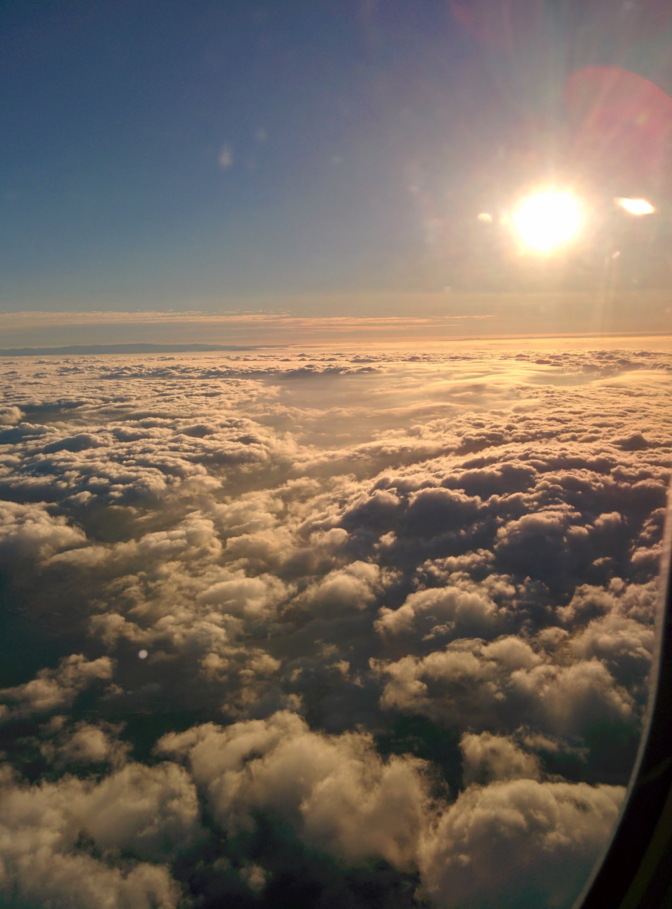
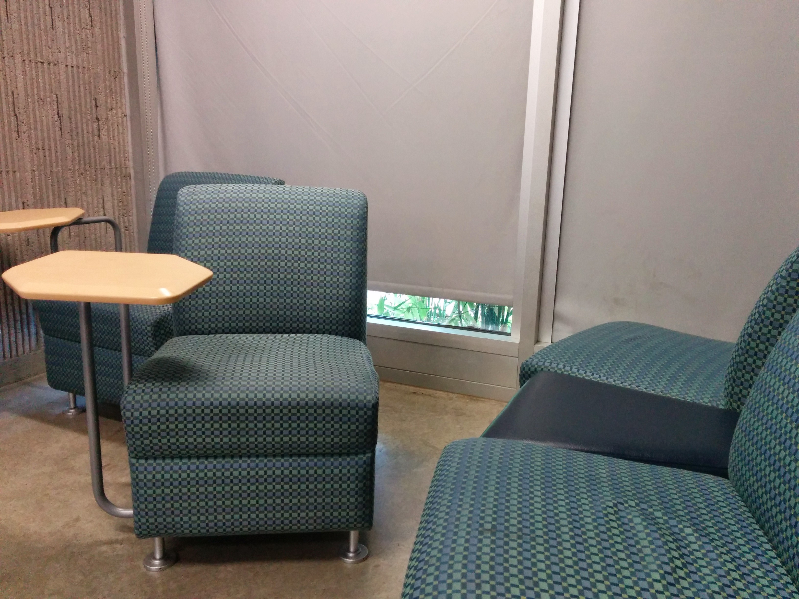
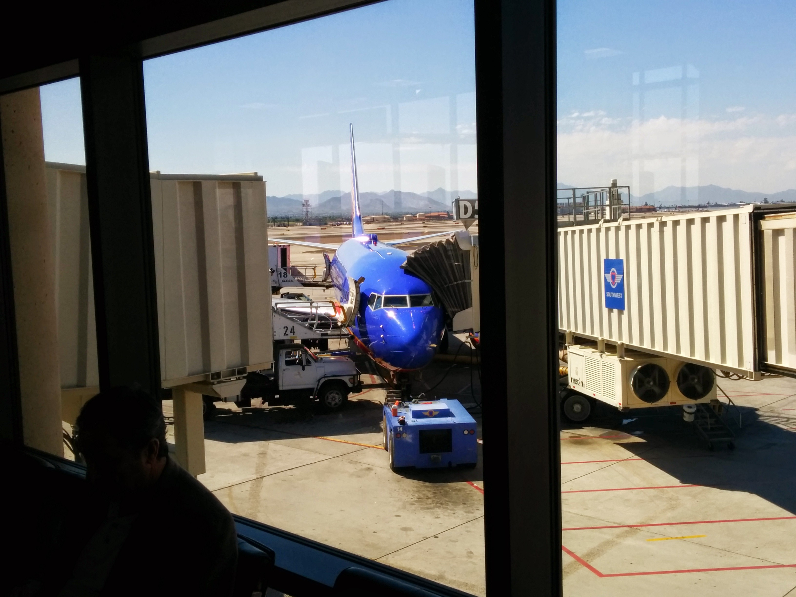

I regularly attend and present at Code Camps, which are weekend get together of hackers and programmers who want to learn or share their knowledge and skills with the community. These events are often very informative and occasionally there are some perks from the sponsors. Desert Code Camp has the best perks by far. Free Breakfast, Lunch, and Dinner for all attendees and a speaker dinner the night before; in addition to the stunning Chandler – Gilbert Community College Pecos Campus. Their signature bridge linking the Ironwood Hall and Estrella Hall attracts visitors and is one of their landmarks at the college.

  
We got up every early Saturday Morning, I could barely make out the time on the alarm clock, 4:30 it read and the sky was like thick moist velvet, no light escaping its grasp. Wolf and I had packed our bags the night before, and we hastily packed up our laptops and got ready to go. Our flight left Lindbergh Field at 7:20, on an hour flight to Phoenix. It was still early in the morning and the sun had teamed up with the marine layer to produce some beautiful views on our very short flight.

Wolf often flies with Southwest for work, accruing miles with every flight. Southwest may not be the least expensive, but they have a nice staff and their flight are mostly on-time. One of our flight attendants, who was also serving us our complimentary beverages had an interesting compliment for us…

> "You two have good taste in frames." –[@SouthwestAir](https://twitter.com/SouthwestAir) with [@wolfpaulus](https://twitter.com/wolfpaulus). [#dcc14](https://twitter.com/hashtag/dcc14?src=hash)
> 
> — Tom Paulus (@tompaulus) [October 18, 2014](https://twitter.com/tompaulus/status/523489875044335617)

We arrived in Phoenix on time, and proceed to the Rental Car Center, a 15 minute bus ride where we were unsettled by the fact that we had to take a number and wait in line for our car. The Budget lobby was filled with travelers, all with a similar display of upset and boredom on their faces to an extent. We eventually got our car, a sporty black Nissan Maxima with sunroof. Wolf, rather quickly, darted out of the parking garage and we were on our way to Gilbert.

We arrived at around 10:30 and found a “Study Room” where we sat down and got caught up on the day’s news since we hadn’t had much time to do so. There were only a few of these rooms in the Ironwood hall and all but one were unlocked. I took some of the time to practice my flying skills for my talk later that afternoon. Wolf went to a session before lunch to learn about “Hadoop” while I stayed in the Study room for another half hour, planning to skip the lunch rush. I got lucky, 10 minutes after I had secured my slice of pizza, the line started to form, and it very quickly grew, eventually surrounding the Student Center; just imagine the iPhone Launch.

Wolf’s talk, “Developing for Android Wear” went well and the audience learned a lot about the new features that allow you, the developer, to create apps that run directly on wearable devices, like the Motorola 360 watch. This year Wolf and I teamed up for our new talk, “Getting started with MultiCopters”. We covered the various components, the central question-Build or buy- and how to fly your new copter. About 35 people attended our session and all of them were interested in the technology, and there were many questions. We finished off the session with a small demo which involved me flying a Hubsan X4, a very small quadcopter-about the size of your hand. The audience ducked as the mosquito like drone came near them, but quickly warmed up and were intrigued.

We left the campus, but we had to stop and take pictures of the bridge as the sun was setting and the sky light up red and orange; a gorgeous sight. (This post’s featured image, look up above!) We took a short drive to our favorite dinner in town, Coach and Willies, in Downtown Chandler. We were both very tired, but enjoyed the food and the ambiance, I believe there as some college football on TV as well. This wasn’t the first time we were in Phoenix for Desert Code Camp, in fact it was our 3rd time; we choose the same hotel each time, and again they did not let us down.  

The Hampton Inn & Suites in Chandler is a nice, clean and comfortable Hotel, with a decent free breakfast, including eggs, toast and freshly made waffles. And just like that, we were headed back to the airport to catch our flight back home.

This is my favorite Code Camp to attend, despite the travel, because of the hospitality and the quality of the talks. Hopefully I can go one more time, probably in April 2015, before I head off to College.
