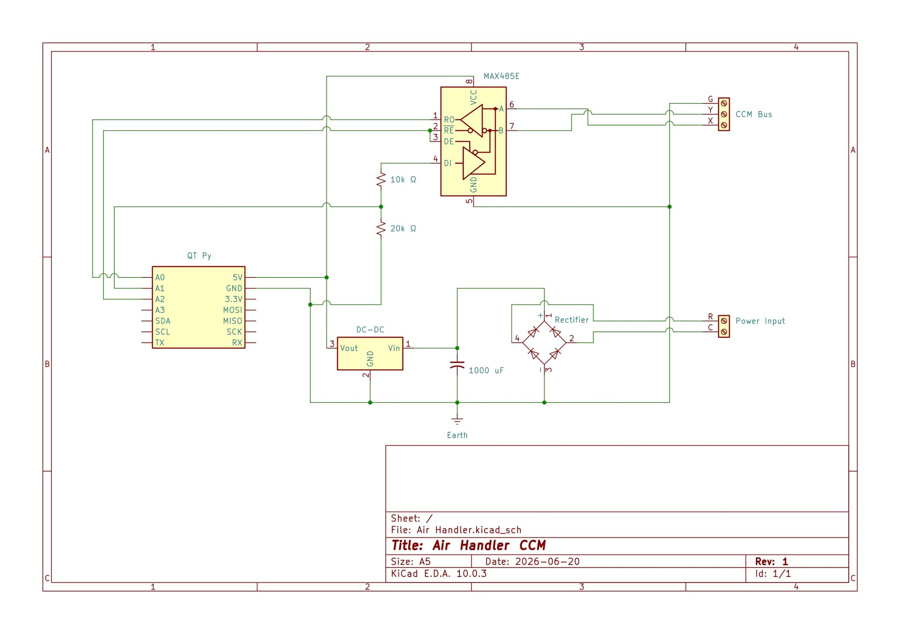

When we moved in to our house just over a year ago, it came with a Nest Thermostat. It worked well enough, and after paying the [3rd Party integration tax](https://www.home-assistant.io/integrations/nest/) to Google, it worked with [Home Assistant](https://www.home-assistant.io/), so we left it at that – we had more impactful improvements to make. When we upgraded the 30+ year old HVAC system a few months later, the Air Handler that replaced our furnace had support for 24V thermostats (for backwards compatibility), so the Nest survived that change as well. However, as the months went on and I made more automations to coordinate the thermostats across the house (the HVAC upgrade added two additional heads to the mix), the reliance on Google's cloud meant that updates to the Nest thermostat from Home Assistant were both slower than the local thermostats, and crucially, relied on the internet for them to work.

I had looked around for other 24V thermostats that integrate directly with Home Assistant, but found nothing that stood out to me. There was a Honeywell Z-Wave thermostat that had good reviews, but was difficult to find as it had been discontinued in favor of the version that had WiFi built-in (and consequently used their cloud). EcoBee's thermostats have HomeKit support, and therefore local control in Home Assistant, but the reviews were mixed, and the thermostats themselves are also rather expensive; so the Nest got to keep its spot on the wall a while longer.

Meanwhile, the two new mini-split heads had been integrated into Home Assistant a few weeks after they were installed. This was trivial thanks to the [Smlite Ductless HVAC Wi-Fi Module](https://cloudfree.shop/product/ductless-hvac-wi-fi-module/). Unlike the air handler, these units were designed for a WiFi module to be plugged directly in to them to enable remote control. As for the air handler, [the wired remote accessory](https://www.dcne.com/product/dls-wired-control-programmable-ksacn1401aaa) is the closest thing to a thermostat that is not a 24V thermostat. While it has built-in WiFi, it only integrates with the brand's cloud, with mixed Home Assistant compatibly, and again relies on a working internet connection. A bit more searching and staring at the air handler's control board revealed a path forward, the central communications bus otherwise used to network multiple units together. The community had reverse engineered the protocol used ([XYE](https://codeberg.org/xye/xye)), and had built an [ESPHome custom component](https://github.com/HomeOps/ESPHome-Midea-XYE) to integrate Home Assistant with XYE.

### The Requirements

Before we go too much further, I should clarify what I was looking for in a thermostat. This should not be too much to ask for, but in the era of the [Internet of Shit](https://x.com/internetofshit?lang=en), every smart home device wants to connect to their proprietary cloud. This would not be so bad if these proprietary clouds supported third party integrations (like Home Assistant), but where is the money in that. Add to that the inevitability of being left with a very nice paperweight (or [empty kibble bowl](https://www.businessinsider.com/what-happened-when-petnet-smart-pet-feeder-went-out-of-business-2021-6)) when the cloud service goes out of business (or is deprecated).

-   Fully Local – No Cloud Dependency
-   Self Contained – Everything needed to fit within the controls area of the Air Handler
-   Same capabilities as we had with the 24V thermostat – set desired temperature, set desired mode (heating / cooling), and read the temperature of the rooms affected by the unit.

Since I could not find any thermostats off the shelf that addressed all of these desires, without introducing yet another cloud dependency, I decided to build my own.

### Hardware

It had been a while since I worked on hardware, but the various GitHub repos I landed on helped me to assemble a rough bill of materials. We needed only 3 main things: an ESP32 based micro-controller, a RS485 transceiver, and an AC to DC converter. The AC to DC converter was result of the self-containment requirement as the only power source available inside the control cabinet that was not 120VAC was the 24VAC terminals (R & C) that would otherwise power a traditional thermostat. I went to school for Computer Science where we all, for the most part, gladly abstracted away the hardware our precious programs ran on to the Computer Engineering and Electrical Engineering departments in the buildings down the road. Consequently, converting between AC and DC was not something I was particularly looking forward to. I bickered with Claude for a while about this problem and ended up with a simple enough 2 stage AC to DC conversion that while not super cost effective, was simple enough for me to build and understand.



#### Bill of Materials

-   [QT PY ESP32-S3 NO PSRAM](https://www.digikey.com/en/products/detail/adafruit-industries-llc/5426/21283802?s=N4IgTCBcDaIIwFYwA4C0CAsYBsqByAIiALoC%2BQA) - The microprocessor driving the whole show
-   [MAX485CPA+](https://www.digikey.com/en/products/detail/analog-devices-inc-maxim-integrated/MAX485CPA/948026?s=N4IgTCBcDaILIEEAaAWAHAVgMIAUEGoBaAOQBEQBdAXyA) - RS485 transceiver, since XYE runs over RS485
-   [DB107-BP](https://www.digikey.com/en/products/detail/mcc-micro-commercial-components/DB107-BP/773574?s=N4IgTCBcDaICICECMAGA7AWgQBQLIGUMA5OEAXQF8g) - A full bridge rectifier, converting AC to choppy DC
-   [ECA-1HM102B](https://www.digikey.com/en/products/detail/panasonic-industry/ECA-1HM102B/2688712?s=N4IgTCBcDaIAoEYCcBWMSDCAVEBdAvkA) - A 1000UF soothing capacitor
-   [TSR 1-2450](https://www.digikey.com/en/products/detail/traco-power/TSR-1-2450/9383780?s=N4IgTCBcDaIIwE4CscC0YDsAWDqByAIiALoC%2BQA) - DC to DC Converter to give us a smooth 5V DC bus
-   [Adafruit 1/2 PermaProto](https://www.digikey.com/en/products/detail/adafruit-industries-llc/571/5353603) - My favorite way to go from breadboard to perf-board
-   [OSTVN02A150](https://www.digikey.com/en/products/detail/on-shore-technology-inc/OSTVN02A150/1588862), [OSTVN03A150](https://www.digikey.com/en/products/detail/on-shore-technology-inc/OSTVN03A150/1588863) & [A 08-LC-TT](https://www.digikey.com/en/products/detail/assmann-wsw-components/A-08-LC-TT/821740) - Terminal Blocks & IC Sockets
-   1 10kΩ and 1 20kΩ ¼W resistor, and some wire

### Software

[ESPHome](https://esphome.io/) is an absolute delight and makes integrating the real-world into Home Assistant a joy. I got my start in hardware over 18 years ago with an Arduino NG thanks to my [Dad](https://wolfpaulus.com/) and things have come a long way since then. ESPHome makes it super simple to utilize ESP32, ESP8266, and RP2040 microcontrollers into build custom smart-home devices. You write YAML files that declare the various components and how they should interact with one another, and ESPHome generates and compiles the relevant C++ code before uploading it to your device. Could you do everything ESPHome does yourself? Sure, but I don't feel like writing support for OTA, WiFi fallback, and all the other nice things that ESPHome brings. When ESPHome does not have support for something, you can extend it via External Components.

Another wonderful feature of ESPHome is that you can pull data out of Home Assistant from your embedded device. This is particularly helpful when you want to supply the Air Handler with the room temperature which comes from a few Zigbee Temperature Sensors. All that leads us to a config file that looks something like this...

```yaml
esphome:
  name: air-handler
  friendly_name: Air Handler

esp32:
  variant: esp32s3
  framework:
    type: arduino # Climate is not supported in esp-idf

logger:
  logs:
    midea_xye: INFO
    uart: WARN

api:
  encryption:
    key: !secret air_handler__encryption_key

ota:
  - platform: esphome
    password: !secret ota_password

wifi:
  ssid: !secret wifi_ssid
  password: !secret wifi_password
  ap:
    ssid: Air Handler Fallback Hotspot
    password: !secret fallback_password

captive_portal:

web_server:

external_components:
  - source:
      type: git
      url: https://github.com/tpaulus/ESPHome-Midea-XYE
      ref: main
    refresh: 1min
    components: [midea_xye]

#UART settings for RS-485 converter
uart:
  # UART1 on QtPy
  tx_pin: 17
  rx_pin: 18
  baud_rate: 4800
  flow_control_pin:
    number: GPIO9

sensor:
  - platform: homeassistant
    id: ha_room_temp
    entity_id: sensor.air_handler_room_temperature

climate:
  - platform: midea_xye
    name: Air Handler
    period: 3s
    timeout: 500ms
    use_fahrenheit: true
    follow_me_sensor: ha_room_temp
    sync_fan_mode_from_device: true
```

### Integration

Anyone who has worked in engineering long enough knows that building the individual components is only half the battle, the true _fun_ comes from trying to integrate all of the disparate pieces, especially when the interface between those pieces is fuzzy. That was especially true in this case. I assembled all of the hardware, but instead of using the resistor-divider for the RX line, I had a TXB0140 level-shifter in its place. I hooked it up to the air handler control board and got `00` out. I hooked it up to the Air Handler and got back a slew of error messages: `Bad response length (0 bytes, expected 32) for Command C0; resyncing`. Time to start troubleshooting.

#### Is it the hardware?

The easiest answer here would be to grab a logic analyzer or a fancy digital oscilloscope and probe the X and Y (A and B for RS485) and see what was going on. Only one problem, I do not own an oscilloscope, let alone a logic analyzer. I have a multimeter, tenacity, and that's it. More bickering with AI followed, the TXB0140 went out, in its place came a simple resistor divider – one less variable. The breadboard made its way in and out of the unit, up and down the stairs at least 5 times. Together with AI, I verified each part of the hardware to ensure that the basic behaviors were as expected. I had reached the point where there was either a software problem, or a comm bus issue.

#### Is it the software?

I had started with fork of [HomeOps](https://github.com/HomeOps)'s [ESPHome-Midea-XYE](https://github.com/HomeOps/ESPHome-Midea-XYE) repo that applied a bug fix [Seerenity](https://github.com/Seerenity) had made which supposedly fixed a dead-lock issue. I had initially sent AI into the mines to add support for Flow-control, as the MAX485 does not have automatic flow control, but during the hardware debugging phase, I had discovered the ESP32 has built-in support for Flow Control, so the custom flow-control changes also went out the window. However, much like with the hardware, there were too many variables. So, with the help of AI (once again), we took a much simpler [example](https://github.com/wtahler/esphome-mideaXYE-rs485/blob/main/esphome-mideaXYE.yaml) from [wtahler](https://github.com/wtahler) and manually constructed frames to send down the wire. Crickets...

Back to the hardware, AI suggested to permanently ground the Receive Enable pin on the MAX485. This would mean that we get an echo, since we would receive our own transmission, but it would eliminate yet another variable. This lead to a _key insight_ - we could hear our own messages. This proved that the hardware was working correctly, and we could send bytes from the ESP32 and parse them back again. That left only a communications issue.

#### Is it the Air Handler?

If I had one piece of feedback for the folks at Carrier about the 45MBAA Air Handler, it would be that the hardware documentation sucks. There are at least 10 dip-switch blocks across the unit and 3 different rotary encoders with tiny labels and close to no documentation on their purpose. The diagrams that are there are confusing and leave the reader to make assumptions. The unit had been configured for a 24V thermostat, this means setting SW1 (A block of 4 dip-switches) to `On On On Off`. The sticker on the front door says for Wired Control, set them to `Off On On On`. This was a lie - in tiny letters in the corner of the control board layout was the key "All DIP Switches default to Off". So, I turned off the unit again, and set all of SW1 to Off, and turned it back on. This time, the seven-segment display on the unit was blank. The immediate first thought was _did I just release the magic (expensive) blue smoke from the control board?_

The panic was thankfully short lived. The power board (right behind the control board), had a green LED light, so it wasn't completely dead. The control board has only a single input, a tactile button next to the seven-segment display. So, like a curious Chile (or cat), I pushed the button and the display flashed on, `EF`. I pushed the button again, `75`. I pushed the button a third time and the display extinguished. This was different, before, it always read `00` on the display, which I had learned to mean idle, since it went to `01` for first stage cooling, `02` for second stage, and `04` meant heat mode.

I went back upstairs to my desk and sent a new set of serial commands to the control board, and this time it got a response. Not just the echo of the command, but a response from the unit. It was alive and working! I changed the ESPHome configuration back to use the custom component and made a few more fixes to get support for the various modes into the Home Assistant climate integration and to fix the representation of the Follow-Me temperature, but it was working!

My fork of the Custom Component is on GitHub for those also looking to convert their Carrier (Midea) Air Handler to direct control.



### Keeping it dumb

So having the air handler in Home Assistant is fantastic, but as a general rule I try to preserve physical controls for all of the things we make smart across the house. This means that at 3am when you want a glass of water, you don't need to get your phone from the room next door and stare into the sun, just to nudge on the lights.

For lighting, we use the Lutron Caseta family of switches which preserve the ability to press a button and have the lights turn on/off. When we added smart shades, a similar button went on the wall, which is powered by Home Assistant, but still obviates the need for a phone, or shouting at Siri to _"please lower the god-damn shades in the living room"_. When it came to the air handler I wanted something similar, and preferably a control mechanism that did not rely on Home Assistant, just in case – I still want my wife to be able to turn on the heater when the server is down. The answer in this case was actually right in front of us, [the wired remote accessory](https://www.dcne.com/product/dls-wired-control-programmable-ksacn1401aaa) from earlier. Notably, it did not rely on the 24V interface that we had disabled to enable the ESPHome device to integrate with the air handler, and could re-use the existing thermostat wires in the wall. eBay to the rescue, and a few days later, the control was on the wall and the best part – it reflects the changes made by Home Assistant, and vis-a-versa. Make a change on the control, Home Assistant reflects it moments later.
