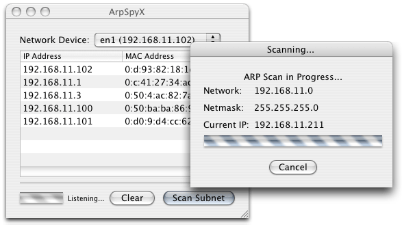

In preparation for [Socal Code Camp](http://www.socalcodecamp.com/), [Getting Started with Raspberry Pi](https://tompaulus.com/talks/) I developed a little app to tell me the IP of my Pi.

From past experience I know that never to trust or depend on the provided WiFi; it is usually slow and locked down. I bring with my my Android smart-phone which as the ability to become a portable mobile hotspot. It lacks some of the benefits of a real router, like static DHCP, but it gets the job done quite nicely. I usually need to open an app called [ArpSpyX](http://thebends.org/~allen/arpspyx/ "ArpSpyX"), and app that monitors arp packets across the network to find the IP address of my Raspberry Pi.

 _Screenshot of ArpSpyX_

This costs valuable time, as Mac OSX restricts the ability for a non-root user to monitor arp packets, and a terminal command needs to be entered each time the app is opened after a reboot.

I began working on this app at Desert Code Camp in April, but I didn’t really need it since then. I found my self with some extra time last night, and decided to finish the app, so I could use it for the talk the upcoming Saturday.  Here it is, the Raspberry Pi IP Display, it takes advantage of [Adafruit’s Character LCD Plate](http://www.adafruit.com/products/1109 "Adafruit RGB Positive 16x2 LCD+Keypad Kit for Raspberry Pi") to clearly and simply display the IP. The script that is called when the Pi boots simply asks the Pi for the available IPs, and it chooses the one it thinks is right. By default it will always favor WLAN, and it chooses the primary interface, i.e. ETH0 not ETH1.

The code is available on GitHub, and I encourage you to clone it and try it out for yourself if you have a Raspberry Pi and a Adafruit Character Display Plate laying around.

[Clone The Repo:](https://github.com/tpaulus/RPi-IPDisplay)  
`git clone https://github.com/tpaulus/RPi-IPDisplay.git`

To enable the app to launched after the Pi has started up, you need to add a few lines to _/etc/rc.local_: `sudo nano /etc/rc.local`

Move the folder to somewhere on your Pi, and remember the path, find it by entering `pwd`. Add the following lines to `/etc/rc.local`: `cd "path to RPI-IPDisplay folder" python display.py &`

When you boot your Pi, it will first initialize the network connection and after all the system processes have been started, IP Display will be initialized. Your display should light-up, and if your Pi has an IP it should be displayed, but if the Pi cannot find any IPs, the display will turn red and will say that, “No IP could be found”. Press the SELECT button to turn off the display after you have noted the IP, if necessary.

Enjoy, Happy Coding!
