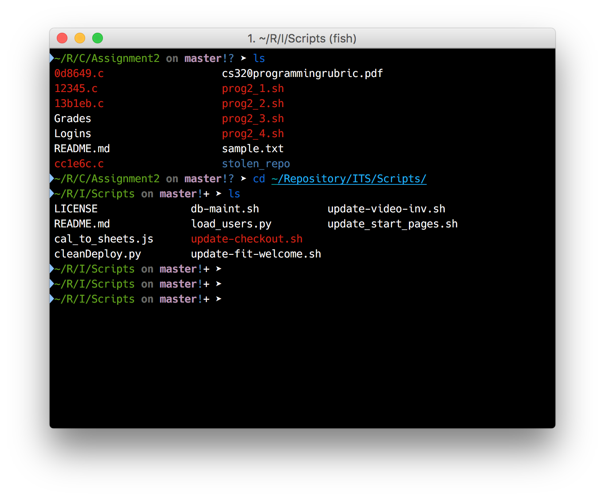

Fish is a great alternative to the default bash or shell that is installed on your computer by default, while Fish is available for a variety of platforms, even Windows (with Cygwin); but this guide will focus on macOS, because that is what I use on a daily basis. It is very easily to install, since they provide a package that you simply download and run and it installs fish to `/usr/local/bin`. However, if you are a bit more savvy and already have Homebrew installed, you can install fish with a single command in your currently very boring shell.

```
brew install fish
```

After the install completes, you will need to allow/whitelist the fish shell to be used, and make it your default shell, unless you want to type `fish` every time you start a session.

```
sudo echo '/usr/local/bin/fish' >> /etc/shells chsh -s /usr/local/bin/fish
```

```
chsh -s /usr/local/bin/fish
```

Now that you have installed, whitelisted, and made it your default shell, you are probably wondering why fish is so cool. Fish’s power lies in its expansibility, especially in the awesome things that other fish enthusiasts have already created. One of these, that is likely already installed is Tackle. To use it, you will likely need to add a few extra dependencies, which can be easily done via another brew install command, and an install script. This script can be run implicitly, but you should understand what the script does before doing so, else bad things could happen. Justin has documented the Tackelbox framework and the code very thoroughly, and I recommend checking out the framework and the install code: [https://github.com/justinmayer/tacklebox](https://github.com/justinmayer/tacklebox)

```
brew install vcprompt grc
```

```
curl -L https://raw.githubusercontent.com/justinmayer/tacklebox/master/tools/install.fish | fish
```

Tackle and Tacklebox requires some configuration to work, but the config is easily modified as it is stored in a hidden file in your home folder, under `~/.config/fish/config.fish`. I have included my config file, adds extra colors and functionality with tools like git, pip, etc.

```
# Paths to your tackle
set tacklebox_path ~/.tackle ~/.tacklebox

# Theme
set tacklebox_theme entropy

# Which modules would you like to load? (modules can be found in ~/.tackle/modules/*)
# Custom modules may be added to ~/.tacklebox/modules/
# Example format: set tacklebox_modules virtualfish virtualhooks

set tacklebox_modules virtualfish virtualhooks
set tacklebox_plugins extract grc pip python up

# Which plugins would you like to enable? (plugins can be found in ~/.tackle/plugins/*)
# Custom plugins may be added to ~/.tacklebox/plugins/
# Example format: set tacklebox_plugins python extract

# Load Tacklebox configuration
. ~/.tacklebox/tacklebox.fish
```



If you have issues, the Fish Shell Website has some great examples and documentation:  [https://fishshell.com/](https://fishshell.com/).
