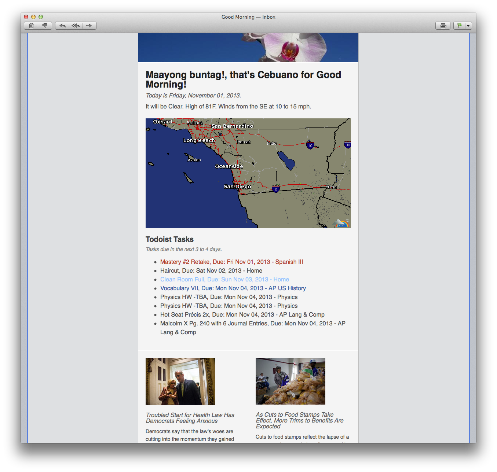

Every morning, I use the same 3 apps: Todoist -to find out what I have to do today, Weather Underground – will it be warm, hot, cold, and a news app – what’s happened while I was sleeping. I needed some app that did all 3 things for me, but after searching Google’s Play store, nothing suited my needs. I decided that I would design my own app.

The Morning Mailer is a [Python](http://python.org "Python Programming Language – Official Website") script that runs on my server, tompaulus.com, and sends me an email, every week day at 6 in the morning. First, greeting me in a foreign language, and then telling me what the weather will be like. Utilizing [Weather Underground](http://wunderground.com)‘s API I gain access to a  concise text forecast for the day and a high-resolution, animated Radar map of my area. The greetings are stored on the server in a “.csv” file, and I can add/remove greetings simply, without having to modify the Python code.

I use [Todoist](http://todoist.com "Todoist: To-do list and task manager. Free, easy, online and mobile") to  keep track on my schoolwork, like homework and upcoming tests and other events. Todoist’s API allows me to access all the pertinent data, making it simple to stay on-track.

The rest of the email contains the four top stories from the [New York Times](http://nytimes.com/), including a picture and summary.

The information is parsed by Python, then injected into a beautiful HTML email, which was downloaded from [MailChimp](http://mailchimp.com)‘s Email Blueprint Github repository. [Clone their repo here](https://github.com/mailchimp/email-blueprints "MailChimp Email Markup Layouts").

The documentation is available on the GitHub Page for this repo: [http://tpaulus.github.io/MorningMailer/](http://tpaulus.github.io/MorningMailer/ "GitHub Pages")

Clone the repo: [http://github.com/tpaulus/MorningMailer](http://github.com/tpaulus/MorningMailer "GitHub Repository")

 _Morning Mailer did its job well!_
