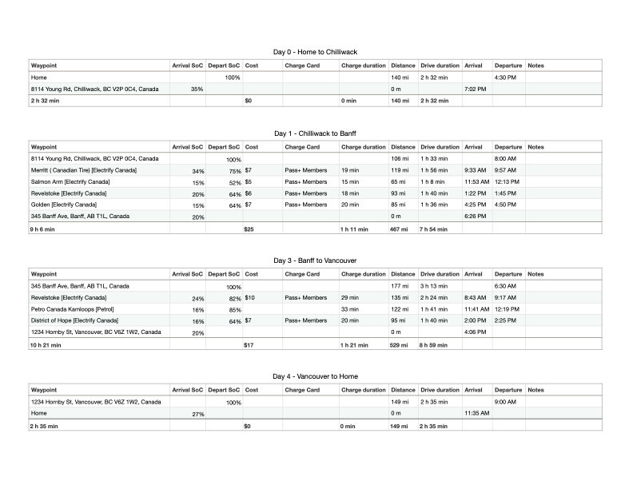
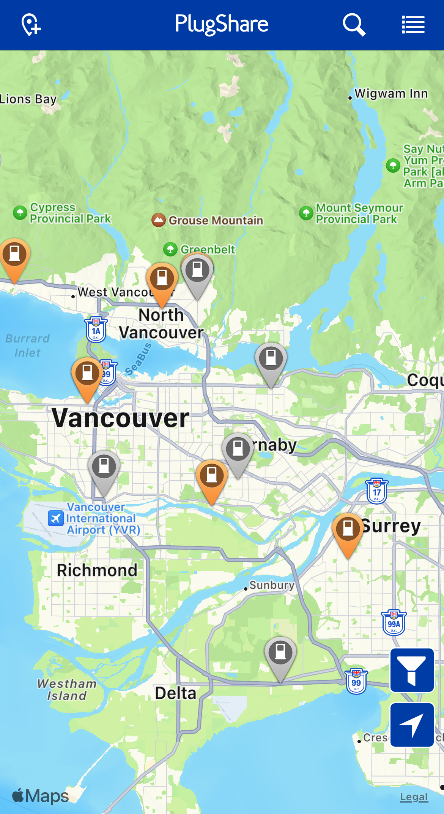

My partner and I got our first Electric Vehicle, a 2023 Volvo XC40 Recharge P8 last November. We had gone on some day-trips and a weekend stay in Quinault, WA (149 miles from Seattle), we had never gone on a road-trip with an EV. That all changed when we drove up to Banff National Park in Canada for the 4th of July weekend.

When I initially planned our trip and where we would stay along the way, I looked for hotels that featured EV Chargers, which would enable us to start the day with a full charge, reducing the amount of time we would spend at charging stations. I also used [A Better Route Planner](https://abetterrouteplanner.com) (ABRP) to plan our route and where we would need to stop and charge. Assuming everything went to plan, ABRP estimated that we would spend just over two and a half hours charging over our 1,285 mile journey, not including our overnight hotel charging sessions.

**Day 0 - Chilliwack**

We started our journey fully charged and made it to the hotel in Chilliwack (just past the US/Canada border). It was an uneventful drive, but we stayed in what we both thought was one of the nicest and newest hotels we had stayed at, the Holiday Inn Express just off the Trans-Canada highway. They even have two Level 2 chargers in their garage that are free for guests to use.

Funny enough, when we were originally planning our route, booking.com showed the hotel as having EV Charging, but we could not find any mention of it on their website, or on PlugShare. I fixed that while we were there, and you can now find that charging location on [PlugShare](https://www.plugshare.com/location/537411).

**Day 1 - Banff**

This felt like the longest day of driving and took us to 4 different chargers, two of which were at Canadian Tire locations. Not being Canadian, we had no idea what to expect when we walked in, looking to stretch our legs after an hour and a half of driving. What we found was a combination of a Walmart (without the food), a Discount Tire, and an Auto Zone, an impressive combination. I could see myself going there quite often if we had one nearby. Just after 6:30pm and after 467 miles of driving, we arrived at our hotel in Banff, hungry and exhausted.

We spent the next day hiking and exploring the town of Banff, which had far more tourists than I had expected, but given that it was the day after Canada Day, I am not surprised.

**Day 3 - Banff to Vancouver**

This was by far our longest day of driving, covering 529 miles; but it felt a lot shorter than our drive out to Banff, potentially because of our early start. We had tickets to see Charlie Puth at the UBC Thunderdome that evening, so time was of the essence. We were fortunate to start our day on a full charge, thanks to the Level 2 charger at the hotel, which gave us enough charge to get the 177 miles to Revelstoke. From there we proceeded to Kamloops, where ABRP scheduled us to go to our first, and only Petro-Canada EV Charger. It seemed that the charging gods had other plans for us though, as the first of two chargers had internet connectivity issues, meaning that it could not start a charge neither via credit card nor via their app; and the second charger would not charge above 35 kW (150kW is the max for the Volvo to put things into perspective). Fortunately, there was an Electrify Canada charger a few miles back, so we back-tracked and got the charge we needed to make it to Hope. In Hope we encountered our first busy charger, where 3 of 4 spots were taken when we arrived, and 2 other EVs queued up shortly after we arrived. Annoyingly for the drivers waiting, two of the other cars were charged well above 80% and their drivers where no where to be seen (DC Fast charging slows down considerably after the battery reaches 80% and it is generally best to unplug and continue on your way once you hit 80% as it will take over an hour to get from 80% to 100%, compared to the 30 minutes it can take to get from 20% to 80%).

After we charged up in Hope, we grabbed some lunch and continued all the way to our hotel in Vancouver.

**Day 4 - Going back home**

We hit a bit of a snag and the hotel we stayed at in downtown Vancouver only had a single charger for both of the 20+ story hotels that shared the parking garage, and we were not the lucky ones, so we started the day off with only 27% charge. ABRP actually struggled to plan a route for us, given our low state of charge and the lack of DC Fast Chargers in downtown Vancouver.

*Compatible DC Fast Chargers in Vancouver, BC according to Plugshare*

Although with some manual tinkering, I was able to get a plan together that had us top up at a Petro station and an Electrify America station once we were across the border. The plan was still somewhat risky, given both our bad experience with the Petro charger in Kamloops, and the fact that there was only a single charger at the location. We ended up getting lucky and the charger was not only available, but provided us with a speedy charge. 20-ish minutes after arriving, we were on our way back home. The rest of the drive home was uneventful, with one additional charging stop at Electrify America in Bellingham which gave us the juice we needed to make it the rest of the way home.

All in all, we spent $69.99 USD for charging, a net cost of 5.44¢/mi on our trip, and spent 3.5 hours at chargers over our 4 days of driving, not too bad considering that we got to spend some of that time getting some food and stretching our legs. We are starting to think about our next trip, driving down to visit my parents in Sedona, Arizona in the fall, making a few stops in California along the way, and given our positive experience with this trip, it looks like we'll be taking the electric Volvo again.
