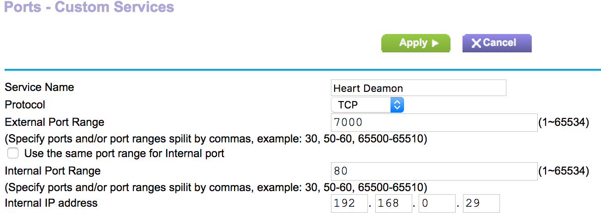
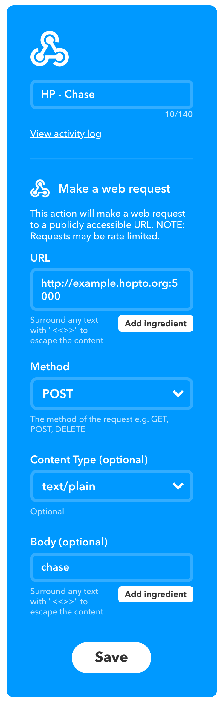
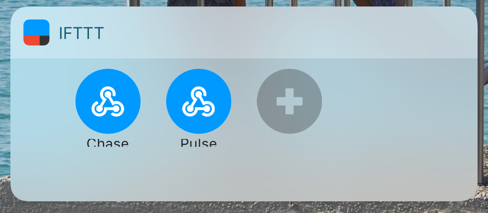
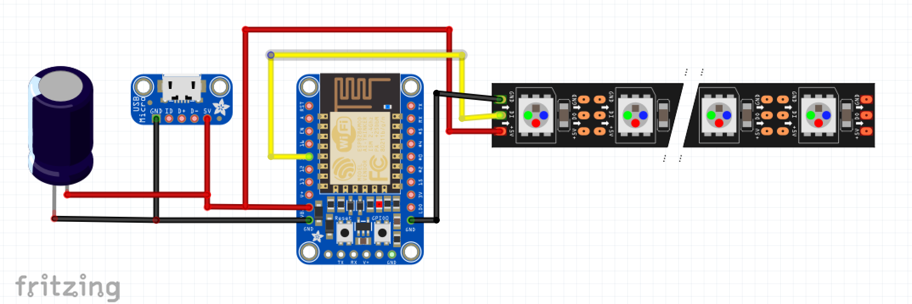
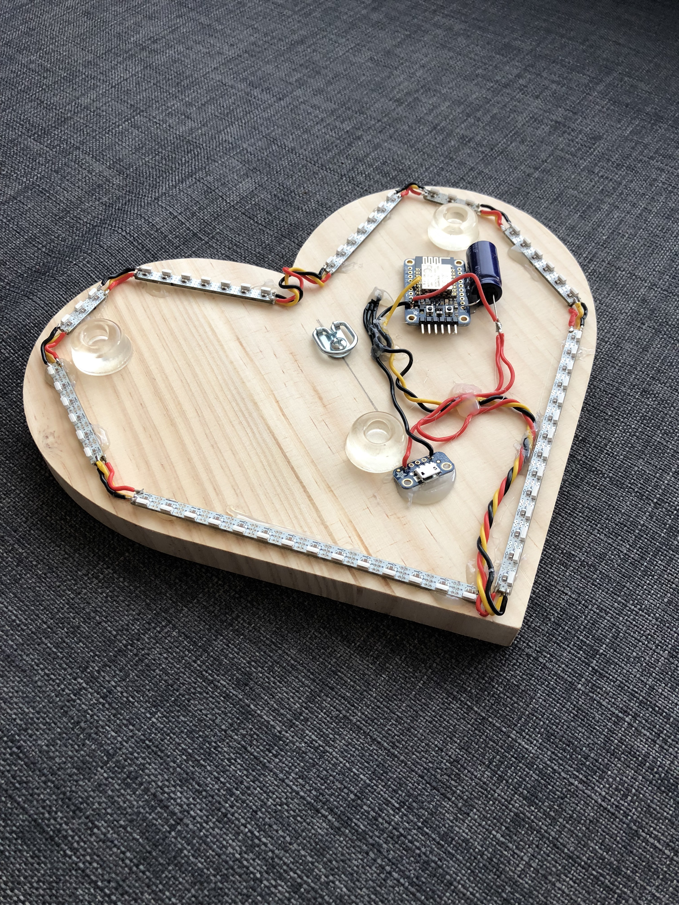

Long Distance Relationships are tough, there is no denying that. But this isn't a post about the woes of love, rather a little project to help bridge the distance. Project Heart is a light that is controlled by your partner, regardless of where they are in the world, as long as they have an internet connection, they can light up your light.

Making use of the [Adafruit ESP8266 HUZZAH](https://www.adafruit.com/product/2471) breakout, we can connect a series of [NeoPixel LEDs](https://www.adafruit.com/category/168) to the network without too much hassle. The basic premise involves the ESP8266 running a simple Web Server that is listening to request on port 80, specifically POST requests with a plain text body of either `pulse` or `chase` to run an animation sequence on the LEDs.

## Software

Programming the ESP8266 with the Arduino software is relatively straightforward after you have set it up. However, keep in mind that you will need a USB to Serial Adapter if you are using the specified Breakout. The Adafruit Feather HUZZAH has this built in, but it a little more expensive. Instructions for setting up the Arduino IDE to program the ESP8266 can be found on the [Adafruit Learning System](https://learn.adafruit.com/adafruit-huzzah-esp8266-breakout/using-arduino-ide).

Allowing the lights to be controlled from anywhere, not just inside of your home network,  presents another fun, but easily solved challenge. All of this is done in your router's settings (typically found in the Advanced Section). First we will want to assign a static IP to the HUZZAH to allow ensure that the device's internal IP remains the same. Next, you will want to set up Port Forwarding to allow the outside world to talk to your device.

<figure class="kg-card kg-image-card"></figure>

> **Note:** Most ISPs block common ports like 80, 443, 8080, so some trial and error may be necessary to find an open port that will work for you. Any open port will suffice. Most routers allow you to map a different external and internal port, which allows us to run the HUZZAH on port 80 for convenience.

Finally, since most ISPs use DHCP themselves to assign your home an IP address, we will want to use a service like [NoIP](https://www.noip.com/) to ensure that we can always reach our home network, even if the ISP decides to issue our Modem a new IP address. How this is setup depends on your router, and the NoIP site has setup instructions for all major manufactures. So, at this point, we should have a URL which we can use to access our HUZZAH from anywhere in the world. Mine looks something like this: `http://example.hopto.org:5000`

You can test out your configuration using an HTTP request tool like [Postman](https://www.getpostman.com/), but that's not very convenient. That's where we can use a service like IFTTT to make our life easier. By combining the button trigger and the Webhook service we can use a widget in the iOS notification center to trigger the light in a matter of seconds.

<figure class="kg-card kg-image-card kg-card-hascaption"><figcaption>IFTTT Widget Settings</figcaption></figure>

You can then add the IFTTT Widget to your Today View to access the animation controls quickly and easily.

<figure class="kg-card kg-image-card"></figure>

## Hardware

The project is pretty simple from a hardware perspective, with a short bill of materials, especially if you have some of the tools already lying around.

<figure class="kg-card kg-image-card"></figure>

The capacitor is optional and provides some power smoothing, which is especially useful for very flashy (high current draw) animations like the pulse. When things are all set and done, mount the board and leds how you see fit, Hot Glue is one of my go to favorites for things like this.

<figure class="kg-card kg-image-card"></figure>

### Bill of Materials

-   [Adafruit HUZZAH ESP8266 Breakout](https://www.adafruit.com/product/2471)
-   [FTDI Serial TTL-232 USB Cable](https://www.adafruit.com/product/70) (Required for programming - although any USB to Serial adapter will due)
-   [USB Micro-B Breakout Board](https://www.adafruit.com/product/1833)
-   [Side Light NeoPixel LED PCB Bar](https://www.adafruit.com/product/3729)
-   Stranded-Core wire
-   Micro USB Cable
-   USB Power Supply (1A should be sufficient for the default animations)

* * *

All of the code for this project is on GitHub and is free for you to use and modify to your heart's content: [https://github.com/tpaulus/Project-Heart](https://github.com/tpaulus/Project-Heart)
