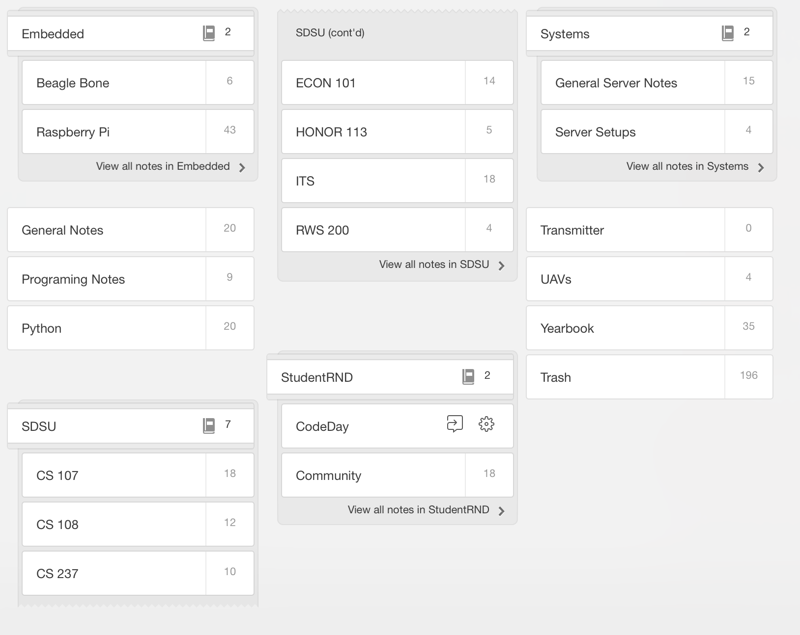
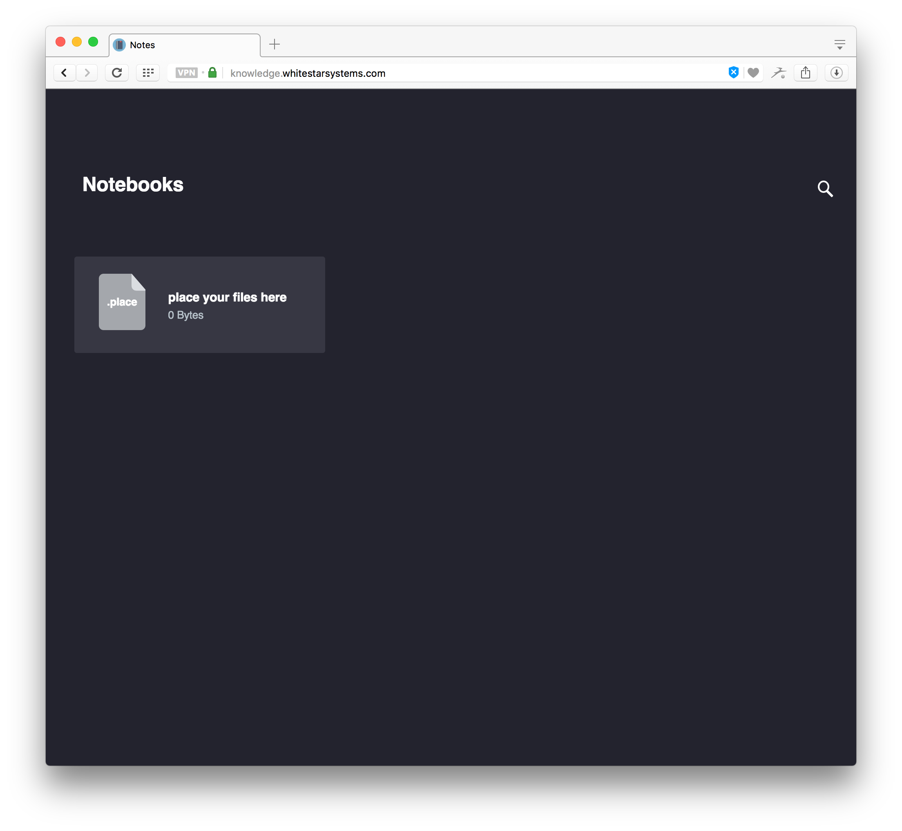
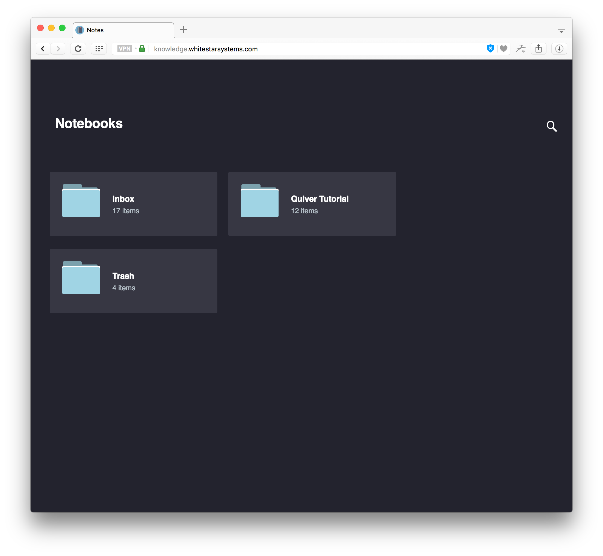
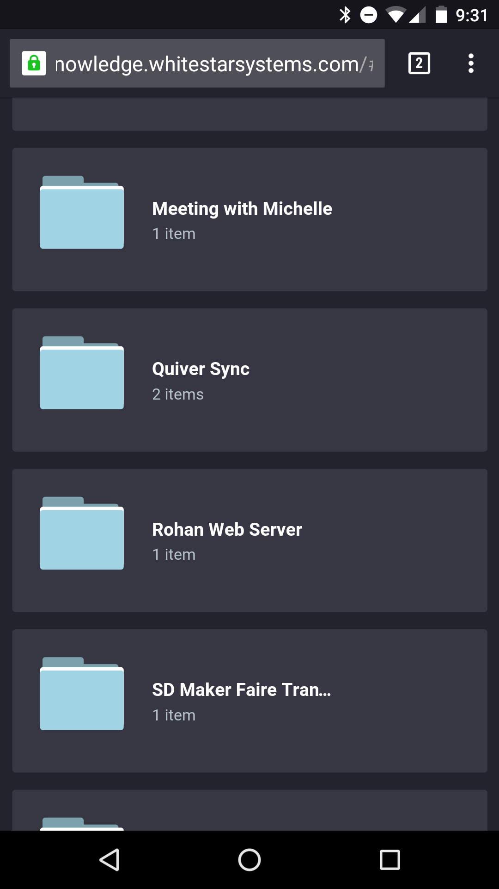
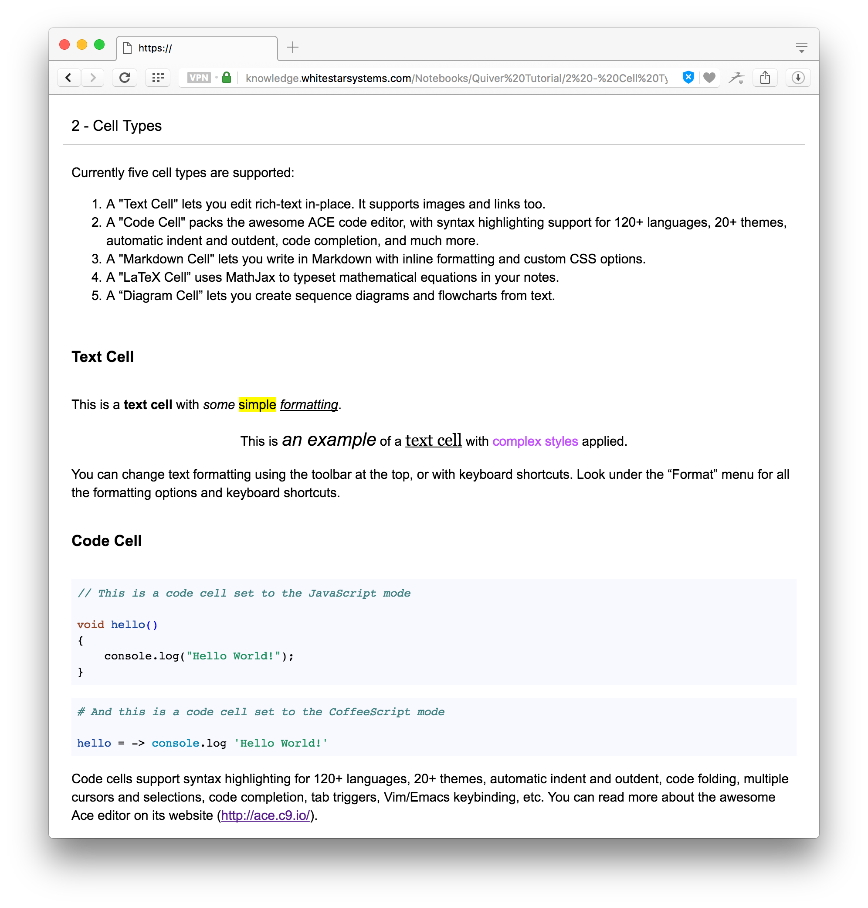
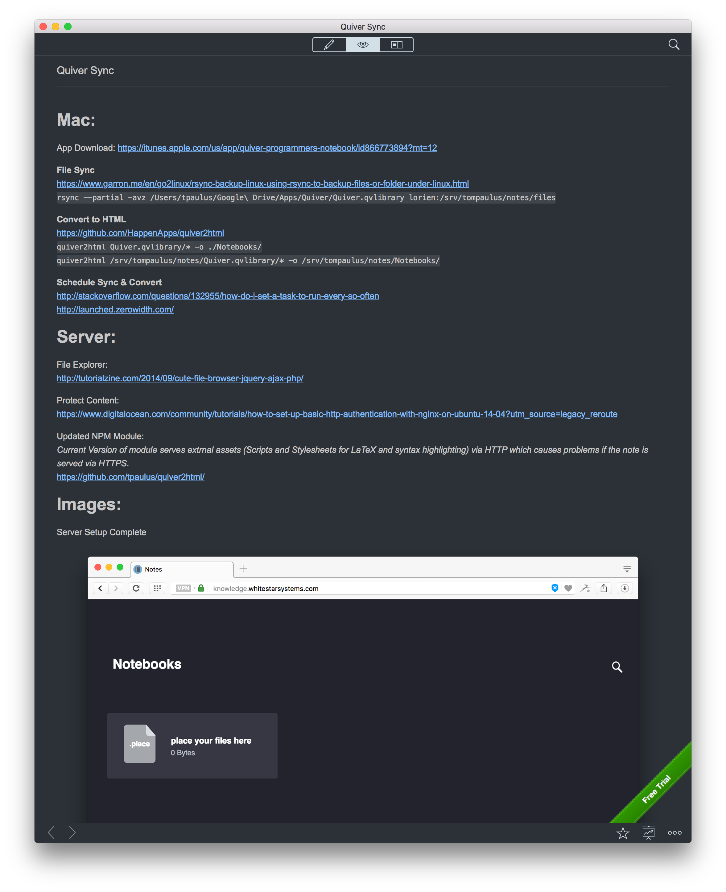

Evernote was the note taking application was the most popular option for a number of years and was the least bad of the options out there. However, recently Evernote has been promoting their paid plans in a way the hurts their free users. Removing popular features, like emailing in notes [(1)](https://help.evernote.com/hc/en-us/articles/209005347-How-to-save-email-into-Evernote), and imposing extra restrictions, like limiting you to only 2 devices [(2)](https://blog.evernote.com/blog/2016/06/28/changes-to-evernotes-pricing-plans/), made me reconsider if Evernote was really the best option out there. Popular alternatives to Evernote at the time of writing include: [Simplenote](https://simplenote.com/), and Microsoft’s [OneNote](https://www.onenote.com/). I like to avoid Microsoft wherever possible, and Simplenotes offerings were average at best, and the reviews did not help sell me on their product.

_I have quite a few notes in Evernote. Thankfully, Quiver can import notes in the Evernote .enex format._

The advantage to products like OneNote, Evernote, and Simplenote is that they offer Mobile apps and Syncing across devices. I rarely find myself editing, or creating notes on my device, but I would like to be able to access notes on the go, just in case (usually for reference purposes). The Apple App Store features [Quiver](http://happenapps.com/#quiver) as one of their “Apps for Developers” and since starting college, I have used Evernote primarily to take notes in class (many of which are Computer Science Courses). If you have ever tried formatting a note in Evernote, you know the nightmare that it is. And while apps like [Alternote](http://alternoteapp.com/) make it a little easier, they still don’t make it easy. Quiver fixes all of their with their innovative approach, which they call cells. Cells are different areas of your note that can be formated as text, code (with syntax highlighting for a bunch of languages), Markdown, LaTeX, or Diagram; all of which are rendered beautifully by the App. The app even supports importing Evernote Notebooks! The only downside for me is that there is no sync engine, or way to view my notes on the go (either on a mobile device or in the cloud).

In order to take my notes on the go, I took advantage of their export script that converts entire notebooks of notes into HTML folders. The files themselves are hosted on my webserver and are displayed via a beautiful jQuery, PHP file explorer from [Tutorialzine](http://tutorialzine.com/2014/09/cute-file-browser-jquery-ajax-php/). While the Quiver Notebook Library is saved in Google Drive (mostly for backups and safe keeping), I am using the very powerful rsync command to sync the library between my mac and the web server.

### Server Setup

Set up a folder (with password protection if you like) with your web server of choice (mine is NGINX) and copy the files from the repo into the folder. Take note of the path of the folder since you will need to enter it into the sync script that we will install on the mac.

[Download the File Explorer and Assets from GitHub.](https://github.com/tpaulus/quiver_sync/tree/master/Server)

1.  Install the [quiver2html](https://github.com/HappenApps/quiver2html) node module. `npm install -g quiver2html`
2.  You will want to set up Apache, NGINX, or your web server of choice to serve the PHP content in the folder you cloned the server files into. Google is your friend here.

When you are done, navigate to the URL for your folder and you should see something like this.



### Mac Setup

We need to configure the computer to sync the Notebook Library automatically and request that the server convert the library into HTML. This is achieved with a simple shell script that is run every 5 minutes by launchctl, Apple’s version of CRON on newer OSs. Launchctl uses specialized plist files (which can be created with [launched](http://launched.zerowidth.com/)) to tell it when to run what command.

[Download the Shell Script and Plist File from GitHub.](https://github.com/tpaulus/quiver_sync/tree/master/Mac)

Update the script’s variables to match your installation.

```
QUIVERLIB_LOC="Path/to/Quiver.qvlibrary"
SERVER="lorien" # Host Name of your server, as set in .ssh/config
SRV_DEST="/srv/notes/" # Public HTTP Directory where Notebooks folder is
```

Copy the shell script to your local/bin folder.

```
sudo cp quiver_sync.sh /usr/local/bin/quiverSync
sudo chmod +x /usr/local/bin/quiverSync
```

The advantage with placing the file in your local bin folder is that you can call “quiverSync” at anytime from your command line to toggle a sync. Now would be a good time to test the script to see if it works before continuing. Take a look at the website and you should see something like this.



If everything is working the way it should, place the launchctl script into the Launch Agents folder. If the `~/Library/LaunchAgents` directory does not yet exists, you can create it with “mkdir”. There are several Launch Agent folders on your computer, the folder in your user library only runs when you are logged in, which is what we want, since you will likely not be making changes to your quiver notes while you are not logged in.

```
sudo cp com.whitestarsystems.quiver_sync.plist \
~/Library/LaunchAgents/com.whitestarsystems.quiver_sync.plist
launchctl load -w ~/Library/LaunchAgents/com.whitestarsystems.quiver_sync.plist
```

### Conclusion

I think that Quiver, with the addition of the sync tool we implemented, will replace Evernote for me. It is an extremely powerful note-taking tool that won’t be charging you monthly per-device. It may not have as many features as the competition, but it serves its purpose for me very well.






