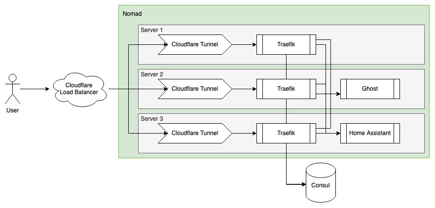

As I've alluded to in the past, Home Assistant plays a major role in making my home work, from managing the HVAC system, to automatically turning on the lights in the utility closet when the door opens. For many years, I ran Home Assistant on an i5 Intel NUC within a Docker Container. This worked great, but when the NUC went down (be it for updates, or some unscheduled maintenance), so did Home Assistant and my ability to control the lights. While my partner is very forgiving and understanding, it's rather annoying to not be able to turn on some of the lights for a few hours while I troubleshoot an issue.

Single-points of failure are scary, and at work, we try to eliminate them wherever possible, so I thought it was time to do the same at home. There are a lot of existing solutions to this problem in the form of orchestration engines, like Docker Swarm, Kubernetes, K3s, etc. We use Kubernetes at work, but it was rather overkill for what I needed to do at home, which was schedule Docker Containers (and ideally Shell Scripts) to run across various nodes in my home-lab (and ideally on a specific schedule). I landed on using Hashicorp's Nomad to get this done. Nomad met all of my needs, all without being too complex.

From the beginning of this project, I had in mind to eventually get 2-3 new servers to enable the decommissioning of the NUC that had been working its little heart out for me for the last 4 years. As such, I wanted to automate as much of the provisioning and management of the new servers as much as possible. I wasn't quite ready yet (or sure of what I wanted to get), so I used the NUC and a _Gaming_ Server I had built a while back to start experimenting.

## Ansible for Provisioning

I love using Terraform for config management, but it doesn't support configuring machines well (there are other tools in the Hashicorp offering that do this, but are heavily focused on the cloud). That left tools like Ansible, Chef, Puppet, and a few others. A little time spent on Google revealed that Ansible was the easiest to get started with, used one of my favorite languages (Python) for extensions, and didn't require complex provisioning workflows.

Ansible has the concept of sharing Roles and Tasks via the Ansible Galaxy. Conveniently for me, there was already a Galaxy Collection for configuring Consul (we'll get to that in a bit) and Nomad. I had to make some adjustments to fit my needs, notably, running both the Nomad Server and Client on the same node.

## Consul for Service Discovery

Before we can talk about Nomad, and container orchestration, we need to talk about Service Discovery. Service Discovery allows us to answer the question, where does X service live and how do I communicate with it. When running containers on a single node, this isn't a significant issue, since the question of where is THE server, and the question of what port can be answered by the container orchestrator (Docker in my case). While we can pin specific container to specific nodes, that doesn't allow us to build a resilient system, which is where tools like Consul come in.

Consul provides a single source of truth for the answer to the what and where question. It adds some extra nice features, like health checks. Nomad more recently started offering a built-in, simple, service discovery option, but Consul still wins out for me because of 1 key feature - DNS. Consul provides a DNS interface for service discovery, which enables non-Consul aware tools, like Home Assistant, to use Consul. For example, by Home Assistant instance depends on an MQTT server, which may be on a different node than the one Home Assistant is running on. While I can’t use dynamic ports, I can use the DNS interface for Consul as the host name for the MQTT server in Home Assistant. In my case, this means that in the eyes of Home Assistant, it can reach the MQTT Server at `mqtt.service.seaview.consul`.

## Nomad for Orchestration

Nomad turned out to be the right balance complexity and resiliency, while not getting in my way too much with its relatively straightforward configuration DSL for jobs. Together with its support for CSI and CNIs it checked all the boxes, and was relatively easy to install and get going, given I had an already operational Consul Cluster.

### CSIs

A lot less cool than Crime Scene Investigators, Container Storage Interfaces, provide a mechanism by which volumes can be mounted to containers. This is another case where having jobs potentially move across nodes presents an issue, as many containers are not stateless and need somewhere to persist their state.

In preparation for the move to Nomad, I replaced the OS on my NAS with TrueNAS Scale, both because of some reliability and connectivity issues I was having with Unraid, but also because of the first-class support TrueNas had for CSIs. In my case, I ended up using the [democratic](https://github.com/democratic-csi/democratic-csi) plugin to enable automatic NFS share creation and management. By connecting the plugin with the TrueNAS API, I am able to create, update, and delete shares from within Nomad, super convenient.

### CNIs

CNI (Container Network Interfaces) allow for adding custom networking interfaces to Docker Containers. This is super convenient if the default `bridge` mode doesn't work for your use case. For me, I like running Home Assistant on its own IP address since it has a bunch of different ports it uses for all the various integrations and those can clash with ports used by other containers. The `macvlan` plugin allows for this (assuming your NIC allows for advertising multiple MAC Addresses). However, because of some fun Linux networking issues that I don't fully understand, containers using `ipvlan` or `macvlan` cannot access the host via its IP address. This posed a problem since I needed to communicate with the Consul Agent on the host to resolve Service Discovery DNS Requests. Not a problem, I would use a plugin called [Multus](https://github.com/openshift/multus-cni) to connect both a `macvlan` and `bridge` interface to the container.

This didn't work. I spent hours troubleshooting issues, ranging from `macvlan` IP address not being released, to no requests making it to/from the container at all. Some more googling showed that there were a number of open issues with CNI support and Nomad dating back to 2021 that had clearly not been fixed. While not ideal, I could work around this problem. Rather than having the containers talk to their host for DNS resolution, I deployed a container to my router that augmented a DNS Server with a Consul agent to enable the containers to get their answers that way.



## Terraform for Config Management

Since the goal of this project was to reduce the manual configuration, I opted to manage my Nomad Job configuration via Terraform. This not only allows my to quickly re-provision all of my jobs, it allows for automated image updates, which we will discuss in a bit.



## Cloudflare Tunnels

While my partner may disagree, I don't run a data center in our garage and we have a single non-static public IP address for the whole house. The solution here comes in the form of a tunnel, specifically Cloudflare Tunnels. I created a `system` job in Nomad to run a Cloudflare Tunnel on every server. This gave me 3 different tunnels, pointing to the same services. While I could use DNS round-robin to route traffic between the servers, that would cause issues if any single server went down, since 1/3 of requests would fail. Using a Cloudflare Load Balancer solves this and allows for more intelligent routing of requests. In my case, I am simply using the health-check option to conditionally send traffic to each of the servers, ensuring that only healthy servers receive requests.



## Foreshadowing

One afternoon, I came into the garage to hear an unusual clicking noise coming from the rack. Some investigation yielded that the CPU Fan on the NUC had died. It was time to take advantage of the high-availability infrastructure I had spent so many hours configuring.

I shut down the NUC and moved the Zigbee Dongle to another server and that was that. Nomad moved the allocations (jobs) from the NUC and scheduled them on another server in the rack. It was wonderful to see how quick and easy it was, especially given all of the headaches this failure would have caused before my Nomad adventure.

## Optimizing Docker Image Upgrades

Back when I was hand managing container configurations on a single node, I would use Watchtower to automatically upgrade my Docker Containers to use the latest images. This approach doesn't work when using Nomad though since it expects the docker configuration to be a certain way, and if the allocation were to get rescheduled to a different node, the updated image tag would not stick, resulting in an older image version being used until Watchtower updated it again (not ideal).

### Renovate to the Rescue

My first thought was to build a tool to do this myself, but that would be a lot of work. My second thought was to clone the GitHub action that bumps the Image Tag in Dockerfiles, but again, that was going to be fair bit of work. We recently started using Renovate to update our dependencies (including Docker Images) at work, and got to thinking if I could adapt Renovate to do this for me. Some digging through the docs later, I found the Regex Manager, which enabled using Regex Expressions to parse files with a specified extension type and pass those to different dependency managers. A bit of cursing at Regex later, I ended up with the following `rennovate.json` which would look through all my `.hcl` files, find the docker images, and upgrade them if needed.

```json
{
  "$schema": "https://docs.renovatebot.com/renovate-schema.json",
  "extends": [
    "config:base",
  ],
  "regexManagers": [
    {
      "fileMatch": ["[^.]+\\.hcl"],
      "matchStrings": [
        "image\\s?=\\s?\"(?<depName>.*?):(?<currentValue>.*?)(?:@(?<currentDigest>sha256:[a-f0-9]+))?\""
      ],
      "datasourceTemplate": "docker",
      "depTypeTemplate": "docker_image",
      "versioningTemplate": "{{#if versioning}}{{{versioning}}}{{else}}semver{{/if}}"
    }
  ]
}
```

And because I configured the integration with the Terraform Cloud, whenever I update the repository (like merging the Renovate PR), the changes are applied to the Nomad Cluster and the running container is replaced.

## Conclusion

I've been running Nomad as my container orchestration system for the last few months and have been rather pleased with the performance and resilience. Servers reboot for updates and I never notice, what more could I ask for. I've still got some more work ahead of me, especially on the container networking front, as I'm not happy having a single point of failure on the DNS side of things, but that's work for another day. For now, I can sleep better knowing my home services are resilient should a server fail again (or just need to reboot for a kernel update).
