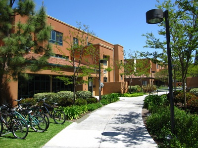
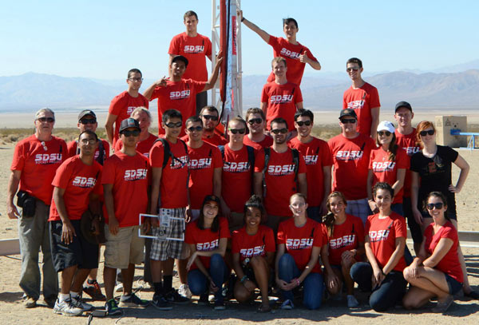

It’s been a long road to get to this point, hundreds of tests, an ungodly number of quizzes and probably killing a tree, maybe a tree and a half [\[1\]](http://www.infoplease.com/askeds/much-paper-one-tree.html). I applied to 11 schools in the fall and got accepted into 7 of them, including schools like UC Irvine, UC Riverside, and San Diego State University. I mention those schools specifically, because those where the schools that I visited, along with my Mom and Dad. It came down to UC Irvine and SDSU.

## UCI

So… I sort of let the cat out of the bag. I’m not going to UCI. However, UCI made it to the finale. Their school has the better reputation and the more recognizable name, as well as a dedicated school for Computer Science and Informatics, something that few other schools have across the country.

  
Middle Earth Residence Halls

Their housing is a step above all as well. Housing was equally old at the schools we saw, but the dorms at UCI, specially Middle Earth, were much more spacious and filled with natural light.

On the other hand, I didn’t feel like I connected with the people who I met; the professors talked down to us, telling us of how good their programs are, but never backing it up. They also told us, repeatedly, that they were “growing” – I don’t know why they stressed that so much, growing isn’t necessarily a good thing. In my experience, when a school grows the student count increases before the faculty count does, reducing the amount of time a professor or TA can spend with their students.

I like to be at the top of my class, it drives me, knowing that I am in the top 5% of my class (like I am now). And the bar is extremely high at UCI. That’s not a bad thing, but it isn’t what I was looking for in a school where I would be spending the next four years of my life, as well as spending an outrageous amount of money.

## SDSU

Shortly after applying to SDSU, I applied to the honors college at SDSU, thanks to the recommendation from Ms. Benke! I was accepted, which gave SDSU an advantage that no other school had in my mind. Honors at SDSU, encourages me, in fact I am required to, study abroad; as well as allow me to work directly with others in the honors program.

SDSU Rocket Project Team – One of very few schools who have developed a Liquid Fueled Rocket.

I was also fortunate to get an in-depth tour of the Engineering department, thanks to Ken Arnold! I got to see actual students, working on actual projects, something I hadn’t seen during other tours. I would also be able to double major, something that sparked my interest. I’m going in as a Computer Science (CS) major this fall, but I might add Computer Engineering (CompE).

> Computer Engineering adds hardware to the perspective, not focusing exclusively on software like Computer Science does. I saw students working with Raspberry Pis and other embedded systems; something that has fascinated me for a while now.

I felt like the people at SDSU were much more friendly, more likely to look up from their crazy looking projects and show us what they were working on.

The dorms were more dated, and since I am a part of the University Honors program, I will be staying in one of the older residence halls, Maya, for my first year. I didn’t let this affect my decision too much, because it would only be for a short time and it was something I could change.

## Overall

I feel like I made the right choice. Only time will tell if this was the right choice, but I am confident that I will make it. This post serves two purposes: One, to share the news; but secondly, to serve as a notepad for myself to remind me why I made the decision that I did, on days where I am sitting in my third Calculus class, asking “Why the F\*\*\* am I here?”

#### _Go Aztecs!_
