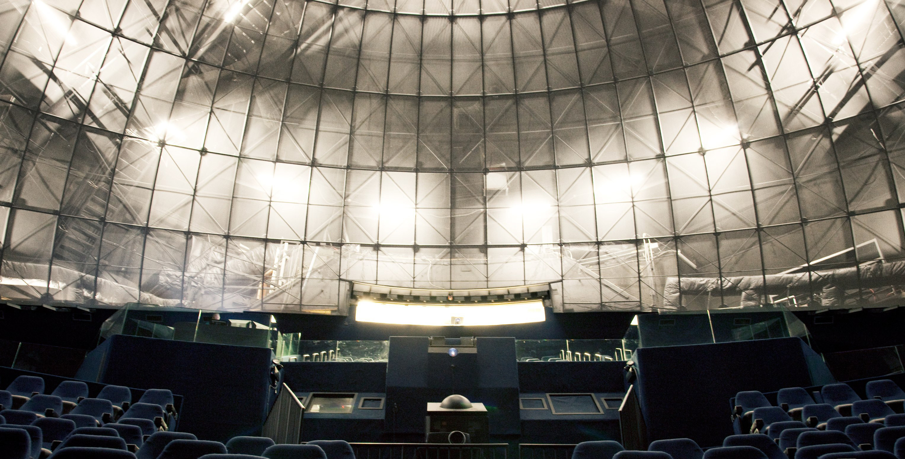
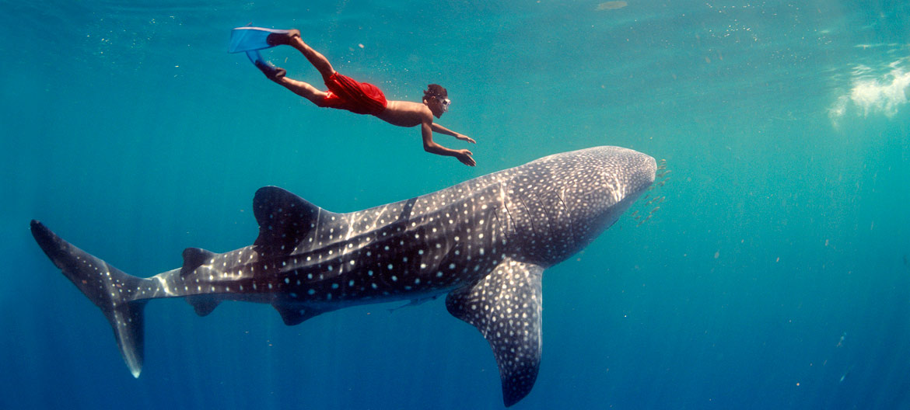

##### _From a Camp Counselor’s Perspective._

This summer I had the wonderful opportunity to volunteer at the Reuben H. Fleet Science center in Balboa Park. I spent most of my time as a Camp Counselor in their Summer Camp program. It was a blast, and I made tons of new friends and vivid memories. I found the Fleet’s volunteer page by accident, while aimlessly googling on a temperate summer morning. I promptly filled out the online application, and to my surprise got a reply within 2 hours from the Volunteer Programs manager, Tanja. I had barely made the deadline, she informed me, but I lucked out of an interview because of the tight time frame. She called me, and we arranged my orientation and shifts for the next months, and she let me know about the upcoming required  workshops to prepare me for my position at the Fleet. The timing was a bit unfortunate, because of the SAT, which was administered on the same day as one of the workshops. I went down there on Sunday, June 7 for my Summer Camp Training, where I met two people who I would be working with for a significant part of my time there. The first was Valerie, the Education Manager and the one primarily responsible for Summer Camp. The second one was Diana, an educator at the Fleet. Also at the orientation was Diane, another educator. During the orientation we learned about our environment, the two “Learning Labs” on the lower level of the fleet, next to the business entrance. The learning labs were very similar to classrooms, with chairs, desks and a white board.  The orientation was very informative and we were split in three groups based on our name tag, but first we played the Snowball game, a game intended to familiarize yourself with your colleagues. Our station rotations were very fast paced; Valerie talked about check in and “BooBoo Incident Reports”. We learned about procedures, like bathroom trips and camper check in and checkout. Diane took us to the Organ Pavilion, a 15 minute walk from the fleet to tell us about “Lunch Bunch” and Collaboration with other summer camps at Balboa Park.

Balboa park has several museums which collaborate to allow campers to spend the morning at one museum, like the Fleet, and the afternoon at another museum, like the Air and Space museum.

Finally with Diana we talked about solving problem withe campers, like sharing and upset campers.  I felt a bit overwhelmed, this was my first exposure to the summer camp environment, I had never done anything like that before. I started camp a few weeks later. “BioTech Boot camp” taught 7-8 graders about Bio Technology, a growing field which is very popular in San Diego area. The campers did various experiments, most of which were very complex, ranging from DNA Extraction to PCRs and Electrophoresis Gels. Ashley, a senior science educator, lead the camper to success most of the time, although some experiments, like a DNA injection into E. Coli bacteria wasn’t very successful. Their fine motor skills were put to the test in their last experiment, a CSI style comparative DNA analysis; they were required to micro-pipet the DNA that had been treated with restriction enzymes into gels with wells that were about 2mm x 5mm. It was clear as the gels were being dyed after they had sat in the tanks for 50 minutes, that they had done their job well. They left on Friday Afternoon knowing things that Biology Majors would know only after a semester or two in college. I had 3 weeks of time off before my next session, which I had piggybacked, because of the drive time from home to the Fleet, which was around 45 miles one-way. I went into my second and final week working with 1-2 graders in the morning, and 3-4 graders in the afternoon. I got to work with Diana as she taught the “Young Tinkers” camp to the 1-2 graders. Diana and I developed an interesting relationship, both feeling the emotional drain that the children put on us. They kids learned about Simple Machines, and took apart old electronic devices, like stereos and old computers; they gained a deeper understanding not for how electronics worked, but how to hit thinks with a hammer till they break. The highlight of the week was the IMAX movie they got to see in the Giant Dome Theater. The operator gave us a peek behind the screen and gasps and oohs and aahs followed. She revealed to us the steel skeleton, and showed us the hidden astronaut behind the dome. [_Journey to the South Pacific_](http://rhfleet.org/shows/journey-south-pacific) has the kids watching in awe as Jawi, a young island boy, explored sea life of the islands of West Papua.

_What’s behind the screen in the Giant IMAX Dome Theater at the Fleet._

 _Journey to the South Pacific_

I enjoyed working with Diana, she kept going even though she was at her limits, pushing through the disrespectful children, who often blurted out answers to her questions. I hope she does well becoming a YouTube star, go subscribe to [PhysicsGirl](https://www.youtube.com/user/physicswoman "PhysicsGirl Youtube Chanel")! I spent my afternoons with Pat, who taught the Chemistry with a Bang camp for 3-4 graders. There wasn’t the bang you expect, with fire and smoke, but everyday featured it own not explosive, but highly reactive reaction. The students learned about Acids and Bases, experimenting with household liquids: dish soap, lemon juice and ammonia. They also investigated the pH of various sour candies, ranging from Skittles to AirHead Extremes. The students then experimented with polymers making the famous Flubber, a mixture of water, borax and glue. They finished up the week with geysers, made of soda and Mentos; they tried various brands of soda in the quest to find the best and most reactive one. The kids had a good time, and we shared many laughs during the week. During my last week, [KEVA Planks](http://www.kevaplanks.com/) were the source happiness for many as they allowed the students to play as they waited. They are an amazing tool and toy alike and recommend getting a set if you don’t live near a museum that has a bunch, like the Fleet.

> I went into this with mixed feelings, but I leave extremely tired, but sad. I hope to do it again sometime soon, but for now school beckons for my attention once more.

All photos are from the \[Reuben H. Fleet Science Center\](http://rhfleet.org).
