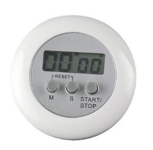
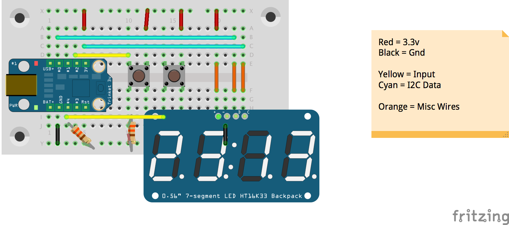

On my last school free Sunday afternoon of the summer, I built a little project to help my Frugal Father.   
My dad had bought a small timer for his DJI Phantom to monitor the flight time, a $6 investment straight from Mainland China. It quickly lived up to the stereotypical expectation of all Chinese products, it failed. The seven segment display began to malfunction, only displaying the tops of the numbers, rendering the timer useless. I felt bad for my dad, I use a [Turnigy 9x](http://www.hobbyking.com/hobbyking/store/uh_viewitem.asp?idproduct=8992&aff=568798 "HobbyKing - Turnigy 9X Transmiter (Mode 2)") with [ER9X](https://code.google.com/p/er9x/ "ER9X Frimware") firmware which allows me to run a timer, which is triggered when I move the throttle stick.

I decided to put my last day off to good use; I pulled out my box of electronics parts, filled with mostly [Adafruit](http://adafruit.com) parts. I found my favorite Seven Segment display, a .56″ White display with an I2C backpack. I had planned to use a Trinket, but quickly realized that I would need to use an Arduino to do the initial prototyping. The Arduino allows me to use the Serial Monitor, a key tool in debugging sketches. The Uno, my favorite of the Arduino boards, also has an auto-reset function which makes uploading sketches a breeze.

I used 2 buttons, I like Adafruit’s [Colorful Square Tactile Button Switch](http://www.adafruit.com/product/1010), because they fit nicely in a breadboard and they add a dash of color to an otherwise colorless project. It was a relatively simple project to wire up, 10 jumper wires and 2 resistors. Things got a bit more interesting when it got to the code though.

I wanted to stay away from the delay function to increment the clock as it pauses the code entirely for the allowed time. I found a library by Simon Monk on the [Arduino Playground](http://playground.arduino.cc/code/timer "Arduino Playground - Timer"). It was just what I needed. I then began to code. I wrote my code objectively, using the things that I had learned from Python to make my code more understandable and easier to implement and maintain. The Timer library allowed my to focus my attention to reading the buttons and updating the display with the correct time, not worrying that I was slowly getting out of sync. The Timer Library is like a timer, you tell it to do something every X milliseconds, or you can tell it to hold pin 10 high for X milliseconds, while your program does something completely different.

After working out the major bugs, I migrated to the Trinket and faced a few more problems. Specifically, I found that pin 3 constantly output 3.3 volts, which made reading the button that was connected to pin 3 impossible. The source of this problem is very clear, pins 3 and 4 are shared with the USB port which is used during programming. The problem was easily solved my moving the button to pin 1. To make your experience a bit smoother, I have rendered the breadboard with Frizzing, and the code is on GitHub.  

[View the Code on GitHub](https://github.com/tpaulus/Trinket-Timer)

Happy Timing!
